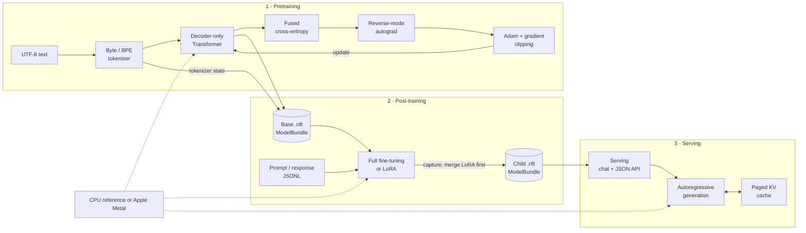
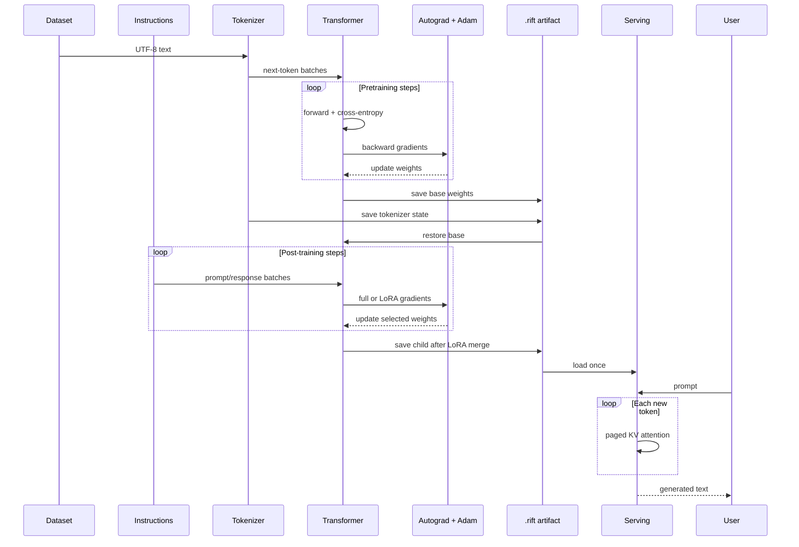

# Riftco Transformer

[](https://pypi.org/project/riftco-transformer/)
[](https://pypi.org/project/riftco-transformer/)
[](https://github.com/quangng2000/riftco-transformer/actions/workflows/release.yml)
[](LICENSE)

A small, auditable decoder-only Transformer built directly in C++20, with a
runtime-dependency-free Python API. Train on CPU or Apple Metal, post-train with
LoRA, save portable artifacts, and serve through paged attention.

| Install | Import | Third-party Python dependencies |
| --- | --- | --- |
| `riftco-transformer` | `riftco_transformer` | None |

This breaking rename exposes only the `riftco_transformer` Python package;
no legacy package-name alias is installed.

## Architecture



| Core | Training | Serving |
| --- | --- | --- |
| Tensors · modules · autograd · C ABI | Flash attention · activation checkpointing · fused Metal Adam · LoRA | Immutable bundles · paged KV cache · sampling · local chat/API |

## From text to chat



> Implemented: pretraining, full/LoRA post-training, immutable model bundles,
> and local serving. Exact resumable optimizer/data checkpoints are future work.

## Setup

### Python

```bash
python3 -m pip install riftco-transformer
python3 -c "from riftco_transformer import Context; print(Context().backend)"
```

Python 3.10+ is supported on Linux, macOS, and Windows. Released wheels include
the native C ABI; macOS wheels also include the Metal backend.

### Homebrew

```bash
brew install quangng2000/tap/riftco-transformer
```

### Source

```bash
git clone https://github.com/quangng2000/riftco-transformer.git
cd riftco-transformer
cmake --preset debug
cmake --build --preset debug
ctest --preset debug
cmake --install build/debug --prefix "$PWD/install"
```

Source builds require CMake 3.24+, Ninja, and a C++20 compiler.

## One training step

```python
from riftco_transformer import (
    Adam,
    DecoderOnlyTransformer,
    Tokenizer,
    TransformerConfig,
    cross_entropy,
)

text = "tiny models learn from text. " * 4

with Tokenizer(text, method="byte") as tokenizer:
    ids = tokenizer.encode(text)
    tokens, targets = [ids[:8]], [ids[1:9]]
    config = TransformerConfig(
        vocabulary_size=tokenizer.vocab_size,
        maximum_context=8,
        model_width=16,
        head_count=4,
        block_count=1,
        feed_forward_width=32,
    )

    with DecoderOnlyTransformer(config).to("cpu") as model:
        with model.parameters() as parameters:
            with Adam(parameters, learning_rate=1e-2) as optimizer:
                with model(tokens) as logits:
                    with cross_entropy(logits, targets) as loss:
                        print(f"loss={loss.item():.4f}")
                        loss.backward()
                        optimizer.step()
```

Use `.to("metal")` on a supported Mac. Construct a fresh forward/loss graph for
every optimizer step.

## Train → LoRA → chat

From a source checkout:

```bash
python3 -m pip install .

python3 examples/python/pretrain_stage.py \
  --backend cpu --steps 10

python3 examples/python/post_train_stage.py \
  --backend cpu --fine-tuning-method lora --steps 5

python3 examples/python/serve_stage.py --backend cpu
```

Open `http://127.0.0.1:8000/`. The stages exchange immutable `.rift` bundles in
`results/stages/`; serving uses a paged KV cache by default.

## Native trainer

```bash
./build/debug/riftco-transformer \
  --config configs/tiny.conf \
  --steps 20 \
  --backend cpu \
  --attention flash \
  --activation-checkpointing block
```

## Explore

| Goal | Start here |
| --- | --- |
| Understand the full model | [Architecture](docs/ARCHITECTURE.md) · [Transformer](docs/TRANSFORMER.md) |
| Learn tensors and gradients | [Tensor](docs/TENSOR.md) · [Tensor operations](docs/TENSOR_OPS.md) · [Autograd](docs/AUTOGRAD.md) |
| Extend layers and modules | [Neural network](docs/NEURAL_NETWORK.md) · [Modules](docs/MODULES.md) |
| Understand training | [Training](docs/TRAINING.md) · [Adam](docs/ADAM.md) · [Activation checkpointing](docs/ACTIVATION_CHECKPOINTING.md) |
| Compare attention paths | [Attention](docs/ATTENTION.md) · [CPU, Metal, and Python](docs/BACKENDS_AND_PYTHON.md) |
| Run all three stages | [Pipeline](docs/PIPELINE.md) · [LoRA](docs/LORA.md) · [Serving](docs/SERVING.md) |
| Prepare Hugging Face data | [Datasets and LoRA experiments](docs/DATASETS_AND_LORA_EXPERIMENTS.md) |
| Navigate or contribute | [Project structure](docs/PROJECT_STRUCTURE.md) · [Roadmap](docs/ROADMAP.md) · [Release automation](python/README.md#release-automation) |
| See feature superposition | [3D vector lab source](visualizations/vector-distribution.html) · [Run the visualization](visualizations/README.md) |

## CMake consumers

```cmake
find_package(riftco_transformer 0.2 CONFIG REQUIRED)
target_link_libraries(my_app PRIVATE riftco_transformer::library)
```

Install Riftco Transformer first, then configure the consuming project with
`-DCMAKE_PREFIX_PATH=/path/to/riftco-transformer/install`. The public C API is
`riftco_transformer::c_api`. See
[CPU, Metal, and Python](docs/BACKENDS_AND_PYTHON.md) for the stable ABI and
backend boundary.

## License

Copyright 2026 Quang T Nguyen. Licensed under the
[Apache License 2.0](LICENSE).
