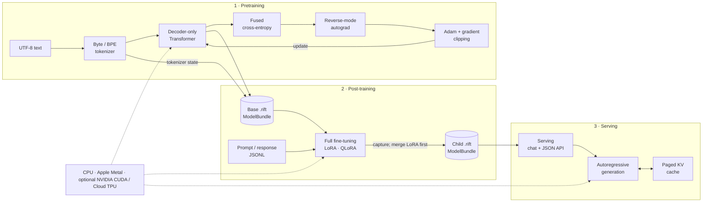

# Riftco Transformer

[](https://pypi.org/project/riftco-transformer/)
[](https://pypi.org/project/riftco-transformer/)
[](https://github.com/quangng2000/riftco-transformer/actions/workflows/release.yml)
[](https://quangng2000.github.io/riftco-transformer/docs/)
[](LICENSE)

An auditable decoder-only Transformer stack with dependency-free Python
workflows over a C++20 execution engine. Python owns data, training loops,
evaluation, labs, and reports; C++ executes tensor math, autograd, models,
losses, Adam, serving primitives, and hardware backends. Train on CPU, Apple
Metal, or optional source-built NVIDIA CUDA and Google Cloud TPU backends;
post-train with full fine-tuning, LoRA, or packed-weight QLoRA, measure held-out
generalization, save portable artifacts, and serve through paged attention.

**[Explore the complete framework documentation →](https://quangng2000.github.io/riftco-transformer/docs/)**

| Install | Import | Third-party Python dependencies |
| --- | --- | --- |
| `riftco-transformer` | `riftco_transformer` | None |

This breaking rename exposes only the `riftco_transformer` Python package;
no legacy package-name alias is installed.

## Backend support

| Backend | Status | Current execution path |
| --- | --- | --- |
| CPU | Supported in every build | Complete readable reference implementation |
| Apple Metal | Supported on compatible Macs | Persistent shared buffers and native Metal kernels |
| NVIDIA CUDA | Optional source build | Managed CUDA storage with native tensor/NN, packed NF4 linear, matmul, attention, and Adam-update kernels |
| Google Cloud TPU | Experimental Linux x86-64 source build | Host-mirrored storage with PJRT/StableHLO packed NF4 linear, matmul, materialized attention, and paged decode |

The TPU adapter is opt-in and dynamically loads Google's external `libtpu.so`;
an absolute zero-library TPU build is therefore not possible. Default builds
and standard wheels retain the dependency-free behavior and contain a clean
unavailable TPU stub. The TPU slice targets one addressable device in one
process. It runs packed NF4 linear forward/input backward, batched matmul,
materialized attention and its gradients, and paged decode through PJRT; Flash
attention and the remaining capabilities stay on audited host reference paths.
CI covers compilation, no-device behavior, and the
loader/compile/transfer/execute/download sequence with a tests-only fake PJRT
plugin. The fake also checks packed quantized-linear forward/input backward for
both scale encodings against the CPU oracle. Real `libtpu` and Cloud TPU
hardware validation is still required before treating it as production
support.

QLoRA's packed-weight linear path is implemented on CPU, Apple Metal, optional
CUDA, and optional TPU builds. CPU decodes in the readable reference loop;
Metal and CUDA decode inside their kernels; TPU uploads packed bytes and
dequantizes inside its StableHLO computation. All four retain the frozen base
without a persistent FP32 expansion. The CUDA sources are wired into the
opt-in CUDA build, and both backends have CPU-oracle test coverage when
available. The TPU sources also pass the local strict C++ syntax check. CUDA
compilation and both backends' actual NVIDIA/Cloud-TPU hardware paths were not
available on this macOS host.

## Architecture

Python owns workflow policy: datasets, batching, high-level training loops,
evaluation, labs, and report generation. C++ owns the reusable execution
engine: tensors, autograd, models, losses, Adam, artifacts, serving primitives,
compiler/analysis components, the task-neutral program-augmented model, and
hardware backends. Python calls that native engine through the stable C ABI;
research protocols such as F/P/T/I remain Python-owned lab policy rather than
installed C++ experiment types.



| Native C++ engine | Python orchestration | Serving |
| --- | --- | --- |
| Tensors · modules · autograd · losses · Adam · NF4 · backends · C ABI | Data · training loops · Full/LoRA/QLoRA policy · evaluation · labs · reports | Native artifacts/KV cache plus Python sampling · local chat/API |

## From text to chat

```mermaid
sequenceDiagram
    participant D as Dataset
    participant I as Instructions
    participant T as Tokenizer
    participant M as Transformer
    participant O as Autograd + Adam
    participant A as .rift artifact
    participant S as Serving
    participant U as User

    D->>T: UTF-8 text
    T->>M: next-token batches
    loop Pretraining steps
        M->>M: forward + cross-entropy
        M->>O: backward gradients
        O-->>M: update weights
    end
    M->>A: save base weights
    T->>A: save tokenizer state
    A->>M: restore base
    loop Post-training steps
        I->>M: prompt/response batches
        M->>O: Full/LoRA/QLoRA selected gradients
        O-->>M: update selected weights
    end
    M->>A: merge adapters; save FP32 child
    A->>S: load once
    U->>S: prompt
    loop Each new token
        S->>S: paged KV attention
    end
    S-->>U: generated text
```

> Implemented: pretraining, full/LoRA/QLoRA post-training, immutable model bundles,
> and local serving. Exact resumable optimizer/data checkpoints are future work.

## Setup

### Python

```bash
python3 -m pip install riftco-transformer
python3 -c "from riftco_transformer import Context; print(Context().backend)"
```

Python 3.10+ is supported on Linux, macOS, and Windows. Standard released
wheels include CPU, and macOS wheels also include Metal. They recognize the
stable `cuda` and `tpu` backend names but contain unavailable stubs; both
accelerators require explicit source builds below.

### Homebrew

```bash
brew install quangng2000/tap/riftco-transformer
```

### Source

```bash
git clone https://github.com/quangng2000/riftco-transformer.git
cd riftco-transformer
cmake --preset debug
cmake --build --preset debug
ctest --preset debug
cmake --install build/debug --prefix "$PWD/install"
```

Source builds require CMake 3.24+, Ninja, and a C++20 compiler.

The installed C++ package separates concerns into
`riftco_transformer::library` (tensor/model/runtime),
`riftco_transformer::compiler` (standard-library-only Cajal compiler), and
`riftco_transformer::analysis` (standard-library-only PCA, interventions, and
ablation statistics). `riftco_transformer::lowering` is the configurable
one-way neural bridge, and `riftco_transformer::programmed` adds reusable
sequence placement, `ProgramAugmentedModel`, and representation capture. Link
only the concern you use; transitive dependencies are supplied by the exported
targets.

## Research labs

Repository-owned experiments live under [`labs/`](labs/) and are deliberately
excluded from both the wheel and installed CMake package. Run them from a source
checkout so Python can import both the public framework package and the lab:

```bash
PYTHONPATH=python:. python3 -m labs.lora_rank.run --help
PYTHONPATH=python:. python3 -m labs.fine_tuning.run --help
PYTHONPATH=python:. python3 -m labs.conditional_reverse.run --help

# Small end-to-end F smoke profile. Check --help for the exact current CLI.
PYTHONPATH=python:. python3 -m labs.conditional_reverse.run \
  --profile quick --variants F --backend cpu \
  --output runs/conditional-reverse/quick.json
```

Generated artifacts and reports belong under ignored `runs/` directories;
small reviewed evidence records may live beside a lab. The conditional-reverse
lab now composes the installed `riftco_transformer.programmed` API: Python owns
F/P/T/I map construction, data, training, validation/test policy, PCA,
ablations, steering, and reports, while C++ executes the generic learned and
programmed graph through ABI 2.5. A `paper` profile is available for the full
configuration; always inspect `--help` before launching a long run.

The generic execution path is implemented and tested. Fresh quick- and
paper-profile results are not claimed here until reviewed run records are
inserted. The retained
[historical F record](labs/conditional_reverse/reports/m4-max-metal-f-seed-42.json)
came from the retired task-specific C++ prototype; it remains single-seed
historical evidence, not a current multi-seed paper reproduction.

For CUDA, use an NVIDIA GPU and compatible driver plus CUDA Toolkit 12 or
newer:

```bash
cmake -S . -B build/cuda -G Ninja \
  -DCMAKE_BUILD_TYPE=Release \
  -DRIFTCO_TRANSFORMER_ENABLE_CUDA=ON
cmake --build build/cuda
ctest --test-dir build/cuda --output-on-failure
```

CUDA is functionally available to tensors, autograd, pretraining, Full, LoRA,
and QLoRA post-training, held-out evaluation, and serving. CUDA tensors use managed
memory; layout, elementwise, reduction, indexing, normalization, loss, matmul,
materialized and memory-linear Flash attention, their gradient kernels, paged
decode, packed NF4 linear forward/input backward, and Adam's candidate-state
update run on the GPU. Autograd traversal
and Adam's overflow-safe global gradient norm remain host control flow over
host-visible storage, so selecting CUDA is not a claim that every part of the
workload is device-resident or faster.

For the experimental Cloud TPU path, use a Linux x86-64 Cloud TPU VM and make
Google's `libtpu.so` available at runtime:

```bash
export RIFTCO_TRANSFORMER_TPU_LIBRARY=/absolute/path/to/libtpu.so
cmake --preset tpu-release
cmake --build --preset tpu-release
ctest --preset tpu-release
```

The loader also checks `TPU_LIBRARY_PATH` and then the system loader path for
`libtpu.so`. On a real TPU host, reconfigure with
`-DRIFTCO_TRANSFORMER_TEST_REQUIRE_TPU=ON` to make device absence a test
failure. The TPU option is off by default and standard wheels do not bundle or
load `libtpu`.

QLoRA defaults to double-quantized NF4 scales and bounded-page Adam state.
Paged Adam stores the two moment vectors as fixed-size tensor pages and updates
one page at a time. On CUDA those pages use managed memory; this is not a
general OS spill, eviction, or page-fault manager.

## One training step

```python
from riftco_transformer import (
    Adam,
    DecoderOnlyTransformer,
    Tokenizer,
    TransformerConfig,
    cross_entropy,
)

text = "tiny models learn from text. " * 4

with Tokenizer(text, method="byte") as tokenizer:
    ids = tokenizer.encode(text)
    tokens, targets = [ids[:8]], [ids[1:9]]
    config = TransformerConfig(
        vocabulary_size=tokenizer.vocab_size,
        maximum_context=8,
        model_width=16,
        head_count=4,
        block_count=1,
        feed_forward_width=32,
    )

    with DecoderOnlyTransformer(config).to("cpu") as model:
        with model.parameters() as parameters:
            with Adam(parameters, learning_rate=1e-2) as optimizer:
                with model(tokens) as logits:
                    with cross_entropy(logits, targets) as loss:
                        print(f"loss={loss.item():.4f}")
                        loss.backward()
                        optimizer.step()
```

Use `.to("metal")` on a supported Mac, `.to("cuda")` in a CUDA-enabled source
build, or `.to("tpu")` in a TPU-enabled Cloud TPU build. Construct a fresh
forward/loss graph for every optimizer step.

## Train → QLoRA → chat

From a source checkout:

```bash
python3 -m pip install .

python3 examples/python/pretrain_stage.py \
  --backend cpu --steps 10

python3 examples/python/post_train_stage.py \
  --backend cpu --fine-tuning-method qlora \
  --nf4-block-size 64 --steps 5

python3 examples/python/serve_stage.py --backend cpu
```

Open `http://127.0.0.1:8000/`. The stages exchange immutable `.rift` bundles in
`results/stages/`; serving uses a paged KV cache by default.

## Explore

| Goal | Start here |
| --- | --- |
| Understand the full model | [Architecture](docs/ARCHITECTURE.md) · [Transformer](docs/TRANSFORMER.md) |
| Learn tensors and gradients | [Tensor](docs/TENSOR.md) · [Tensor operations](docs/TENSOR_OPS.md) · [Autograd](docs/AUTOGRAD.md) |
| Extend layers and modules | [Neural network](docs/NEURAL_NETWORK.md) · [Modules](docs/MODULES.md) |
| Understand training | [Training](docs/TRAINING.md) · [Adam](docs/ADAM.md) · [Activation checkpointing](docs/ACTIVATION_CHECKPOINTING.md) |
| Compare attention paths | [Attention](docs/ATTENTION.md) · [Execution backends and Python](docs/BACKENDS_AND_PYTHON.md) |
| Run all three stages | [Pipeline](docs/PIPELINE.md) · [LoRA](docs/LORA.md) · [Serving](docs/SERVING.md) |
| Compare full tuning and LoRA | [Post-training generalization](docs/GENERALIZATION.md) |
| Fine-tune with packed NF4 base weights | [QLoRA](docs/QLORA.md) |
| Compile programs and run the Python-owned conditional-reversal study | [Compiling programs to Transformers](docs/COMPILING_TO_TRANSFORMERS.md) |
| Prepare Hugging Face data | [Datasets and LoRA experiments](docs/DATASETS_AND_LORA_EXPERIMENTS.md) |
| Navigate or contribute | [Project structure](docs/PROJECT_STRUCTURE.md) · [Roadmap](docs/ROADMAP.md) · [Release automation](python/README.md#release-automation) |
| See feature superposition | [3D vector lab source](visualizations/vector-distribution.html) · [Run the visualization](visualizations/README.md) |

## CMake consumers

```cmake
find_package(riftco_transformer 0.5 CONFIG REQUIRED)
target_link_libraries(my_app PRIVATE riftco_transformer::library)
```

Install Riftco Transformer first, then configure the consuming project with
`-DCMAKE_PREFIX_PATH=/path/to/riftco-transformer/install`. The public C API is
`riftco_transformer::c_api`. See
[Execution backends and Python](docs/BACKENDS_AND_PYTHON.md) for the stable ABI and
backend boundary.

## License

Copyright 2026 Quang T Nguyen. Licensed under the
[Apache License 2.0](LICENSE).
