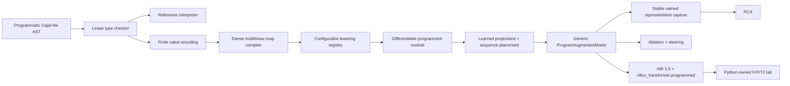

# Compiling Programs to Transformers

This lab is building a compiler inspired by Joey Velez-Ginorio's
[Compiling to transformers](https://www.engineering.upenn.edu/~joeyv/assets/docs/compiling-to-transformers.pdf).
The long-term goal is to write a small, typed program, compile part of that
program into known Transformer weights, and train the rest of the model around
it. That gives us a ground-truth algorithm inside an otherwise learned model.

The reusable compiler, lowering, programmed-sequence, and analysis slices are
implemented. The Cajal-lite symbolic frontend
provides an immutable AST, finite linear types, a Cajal-style linear-context
checker, and a deterministic reference interpreter. The backend-neutral
compiler then encodes finite values and recursively lowers a checked expression
to one dense multilinear map. An optional neural-lowering target now
materializes that map as a differentiable frozen or trainable module using an
exact dense contraction, unary linear map, or bilinear identity-kernel
linear-attention construction. A reusable sequence adapter surrounds a program
with learned projections, places its result into target positions, and captures
named representations. `ProgramAugmentedModel` now composes that core with
residual ReLU feed-forward and parallel learned causal-attention paths, and ABI
2.5 exposes it through the installed `riftco_transformer.programmed` Python
package. Keeping symbolic, execution, and analysis policy at explicit
boundaries makes the pieces auditable and reusable.

The former exact conditional-reverse target and learned F/P/T/I model were
task-specific C++ experiment code and remain retired. Their reusable mechanics
are now generic framework APIs; top-level `labs/conditional_reverse` owns the
task, sparse F/P/T/I program specifications, deterministic data, training and
evaluation, PCA/ablation/steering policy, and reports. One historical F record
remains explicitly labelled as evidence from the retired prototype, not as a
fresh multi-seed reproduction of the new path.

## Why this is not a general lambda calculus

Cajal resembles a typed lambda calculus because it has variables, binding,
products, sums, and case analysis. It is first-order, however: there are no
function values, function types, closures, or higher-order application. This is
useful for compilation because every type denotes a finite-dimensional vector
space.

A future lambda-calculus frontend could specialize finite, first-order
functions and lower them into this core. Adding unrestricted closures directly
would lose the simple finite representation needed by this compiler.

## Current pipeline



Every arrow through the generic Python surface is implemented. What remains is
evidence work rather than a composition gap: archive fresh smoke results, then
run validation-controlled, paper-scale multi-seed F/P/T/I comparisons.

## Finite types

Let $d(\tau)$ be the number of scalar coordinates used to encode type $\tau$.

| Cajal-lite type | Intuition | Coordinate count |
| --- | --- | --- |
| `Unit` | one trivial value, $()$ | $d(1)=1$ |
| `Sum<A, B>` | either an `A` or a `B` | $d(A\oplus B)=d(A)+d(B)$ |
| `Product<A, B>` | an `A` together with a `B` | $d(A\times B)=d(A)+d(B)$ |
| `Dictionary<K, V>` | a linear map from keys to values | $d(K\rightharpoonup V)=d(K)d(V)$ |

Sums use separate tagged coordinate blocks. Products are direct products, so
their vectors are concatenated. For one-hot enum keys and identity lookup, a
dictionary is represented later as a sum of key/value outer products:

```math
D = \sum_i v_i k_i^\mathsf{T},
\qquad
\mathrm{lookup}(D,q)=Dq.
```

That final equation is linear attention without softmax: orthogonal enum keys
select values by an inner product with the query.

## Dense multilinear maps

For an expression with ordered free-variable dimensions
$d_1,\ldots,d_k$ and output dimension $d_{\mathrm{out}}$, the compiler stores
a dense coefficient tensor

```math
T \in \mathbb{R}^{d_{\mathrm{out}} \times d_1 \times \cdots \times d_k}.
```

The output is the contraction of one input vector with each input axis:

```math
y_o = \sum_{j_1=1}^{d_1}\cdots\sum_{j_k=1}^{d_k}
T_{o,j_1,\ldots,j_k}
\prod_{i=1}^{k} x^{(i)}_{j_i}.
```

The implementation stores coefficients output-major in a flat `double`
vector. A closed expression has $k=0$, so its map is constant and
$y_o=T_o$. `compile(expression, ordered_context)` type-checks the expression,
preserves that context as the input-axis order, and recursively constructs the
map for constants, variables, sums, additive products, sequencing, `let`,
`case`, dictionaries, and lookup.

ABI 2.5 and Python also accept sparse import by output-major flat index:
`MultilinearMap.from_sparse(input_dimensions, output_dimension, indices,
values)`. This avoids constructing a coefficient-sized Python list and is how
the conditional-reversal lab describes its mostly-zero F/P/T maps. It is an
import boundary, not a claim of sparse execution: the current C++ map and
lowering strategies still materialize a dense native coefficient tensor after
checking the configured element limit.

## Modular neural lowering

The symbolic frontend is the standalone `riftco_transformer::compiler` CMake
target, while neural lowering is the separate
`riftco_transformer::lowering` target. Lowering depends one way on the compiler
and tensor runtime; neither the frontend nor `MultilinearMap` depends on
tensors, autograd, a model, or a hardware backend. Compiler-only tests link
only the compiler archive, so the separation is enforced rather than
conventional. A strategy registry is the extension point for later sparse,
factored, fused, or hardware-specific representations.

The executable interface is representation-neutral too: `metadata().tensors`
lists every owned tensor and `named_tensor(name)` inspects one by name. It does
not force a future factored strategy to pretend it has exactly one weight.
Trainable tensors use the ordinary `Module::parameters()` lifecycle, so Adam
and other optimizers need no compiler-specific adapter.

Link only the concern an application uses:

```cmake
target_link_libraries(symbolic_tool PRIVATE riftco_transformer::compiler)
target_link_libraries(neural_tool PRIVATE riftco_transformer::lowering)
target_link_libraries(analysis_tool PRIVATE riftco_transformer::analysis)
target_link_libraries(sequence_tool PRIVATE riftco_transformer::programmed)
```

The lowering and programmed targets carry their one-way dependencies
transitively. `analysis` and `compiler` each remain
standard-library-only and do not link the tensor runtime.

| Strategy | Accepted arity | Computation | Exactness |
| --- | ---: | --- | --- |
| `dense` | any | $T(x_1\otimes\cdots\otimes x_k)$ | exact subject to the configured FP32 policy |
| `linear` | 1 | $Tx$ | exact subject to the configured FP32 policy |
| `linear_attention` | 2 | form a dynamic linear map from one input, then apply it to the query input | exact identity-kernel contraction; no softmax or scale |
| `mlp` | none yet | capability placeholder | rejected, or explicitly redirected to `dense` by policy |

For a bilinear map with the second input selected as the query, the attention
strategy evaluates

```math
A(x)_{o,j}=\sum_i T_{o,i,j}x_i,
\qquad
y_o=\sum_j A(x)_{o,j}q_j.
```

This is the paper's programmed identity-kernel linear-attention operation, not
the decoder's learned scaled-softmax Q/K/V attention. Calling the current GELU
feed-forward layer an exact lowering would also be misleading, so `mlp`
remains an explicit unsupported capability until a mathematically valid
construction is implemented.

Configuration controls representation without changing the compiler:

```cpp
#include "riftco_transformer/lowering/lowering.hpp"

namespace lowering = riftco_transformer::lowering;

lowering::NeuralLoweringConfig config;
config.strategy = lowering::kAutomaticStrategy;
config.automatic_strategy_order = {
    lowering::kLinearStrategy,
    lowering::kLinearAttentionStrategy,
    lowering::kDenseContractionStrategy,
};
config.unsupported_strategy =
    lowering::UnsupportedStrategyPolicy::Reject;
config.precision = lowering::CoefficientPrecision::RequireExactFloat32;
config.initialization = lowering::CoefficientInitialization::Compiled;
config.trainable = false;
config.backend = riftco_transformer::ExecutionBackend::Cpu;

const lowering::LoweringAnalysis analysis =
    lowering::analyze_neural_lowering(program, config);
auto module = lowering::lower_to_neural(program, config);
```

`auto` tries the configured strategy order, so unary maps select `linear`,
bilinear maps select `linear_attention`, and other arities select `dense` by
default. `DenseFallback` makes a rejected named strategy fall back explicitly
rather than silently. Callers can register custom strategies without editing
the Cajal compiler. Inactive policy fields are independent: an explicit custom
strategy does not need a valid `auto` order, and compiled initialization does
not depend on random-initialization scale.

`Compiled` initialization materializes the compiler coefficients. Exact FP32
mode rejects a coefficient that cannot make a lossless `double` to `float`
round trip; rounded mode records the maximum conversion error in both analysis
and module metadata. `RandomUniform` is a seeded, shape-preserving ablation and
therefore does not claim to preserve the compiled program. With
`trainable=false`, coefficients are frozen graph leaves and no parameter is
registered; with `trainable=true`, the sole named parameter is
`coefficients`, ready for any optimizer that consumes a `ParameterList`.

For nonconstant maps, every input has shape `[..., d_i]`, all leading shapes
must agree, and the result has shape `[..., d_out]`. A zero-arity map uses
`forward_constant(leading_shape)` because it has no input from which to infer
batch or sequence dimensions; `forward({})` is its unbatched shorthand. The
configured CPU, Metal, CUDA, or TPU backend is used only when that backend is
available in the build.

## A tiny checked program

The current API constructs syntax directly in C++; a parser would add surface
syntax but would not change the language semantics.

```cpp
#include "riftco_transformer/compiler/cajal/cajal.hpp"

namespace cajal = riftco_transformer::compiler::cajal;

const cajal::Type bit =
    cajal::Type::sum(cajal::Type::unit(), cajal::Type::unit());

const cajal::Expression identity = cajal::Expression::case_of(
    cajal::Expression::variable("bit"),
    "zero",
    cajal::Expression::inject_left(
        cajal::Expression::variable("zero"), cajal::Type::unit()),
    "one",
    cajal::Expression::inject_right(
        cajal::Type::unit(), cajal::Expression::variable("one")));

const cajal::Value one = cajal::Value::inject_right(
    cajal::Type::unit(), cajal::Value::unit());
const cajal::Value result = cajal::evaluate(identity, {{"bit", one}});
```

`evaluate` derives a type context from the supplied values and invokes the
checker before interpreting the program. The result above is the same right
injection and has type `Sum<Unit, Unit>`.

## What the linear checker protects

The checker distinguishes multiplicative composition from additive
alternatives. This distinction preserves the theorem that a program with $k$
free variables denotes a $k$-linear map:

- `tuple(x, x)` is accepted: both additive product components use the same
  context, and $x\mapsto(x,x)$ is linear.
- `tuple(x, y)` is rejected under context `{x, y}`: its components consume
  different contexts and $(x,y)\mapsto(x,y)$ is not bilinear.
- `sequence(x, y)` splits its context between the two computations; using `x`
  twice there is rejected.
- a `let` binder must appear exactly once in its body.
- both sides of a `case` must consume the same external bindings, because only
  one branch runs.
- all dictionary keys share one context, all values share another context, and
  the key and value contexts are disjoint. This makes every outer-product term
  homogeneous in the same inputs.
- bound names cannot shadow other names, which keeps diagnostics and later
  compilation unambiguous.

Product components are suspended computations. Constructing a tuple does not
run either component; projection evaluates only the selected component. This
matches Cajal's additive product semantics and prevents an error in an
unselected component from changing the result.

Dictionary entries are suspended for the same reason. Lookup evaluates every
key needed to establish a unique match, then evaluates only the selected value.
An error in an unrelated value therefore cannot change a successful lookup.

## Deterministic dictionary semantics

The paper permits nondeterministic choice when several dictionary keys match.
Cajal-lite instead requires exactly one match:

- one matching key returns its value;
- no matching key raises `EvaluationError`;
- multiple matching keys raise `EvaluationError`.

This makes tests reproducible while the compiler is being built. Adding an
explicit set or distribution of possible results is preferable to hiding
nondeterminism in the current `Value` API.

Identity lookup currently accepts only enum keys: `Unit`, or nested sums made
entirely from `Unit`. Their encodings are one-hot and orthogonal, so a dot
product implements exact identity matching. Product keys require the paper's
explicit relation matrix and are rejected for now rather than compiled
incorrectly.

Dictionary coordinates are intentionally algebraic rather than a serialization
of the source entry list. Several lists can sum to the same key/value outer
products, and source dictionary lists are unbounded, so dictionaries have no
generic `decode` or exhaustive `enumerate_values` operation.

There is also a deliberate boundary between discrete source semantics and the
extended algebraic map. The deterministic interpreter throws when lookup finds
no match or multiple matches. The compiled contraction instead produces zero
for no match and a superposition for multiple matches or non-discrete
coordinates. Compiler equivalence is therefore asserted on accepted, total,
unique lookups over discrete finite inputs; behavior outside that domain is the
linear extension, not deterministic interpreter behavior.

## Source map

```text
include/riftco_transformer/compiler/cajal/
  type.hpp          finite type algebra and dimensions
  expression.hpp    immutable program AST
  value.hpp         immutable interpreter values
  checker.hpp       contexts and type-checking contract
  interpreter.hpp   runtime environment and evaluation contract
  encoding.hpp      finite coordinate encoding and discrete decoding
  multilinear_map.hpp dense backend-neutral k-linear coefficient maps
  compiler.hpp      checked AST-to-map compilation contract

src/compiler/cajal/
  type.cpp
  expression.cpp
  value.cpp
  checker.cpp
  interpreter.cpp
  encoding.cpp
  multilinear_map.cpp
  compiler.cpp

include/riftco_transformer/lowering/
  config.hpp        policy, precision, initialization, backend, and limits
  module.hpp        differentiable module and inspectable metadata
  strategy.hpp      strategy interface, registry, analysis, and map bridge
  cajal.hpp         CompiledProgram bridge
  lowering.hpp      aggregate public include

src/lowering/
  config.cpp
  module.cpp
  strategy.cpp
  cajal.cpp

include/riftco_transformer/analysis/
  matrix.hpp        standard-library row-major observation data
  representation.hpp named, owning activation traces
  pca.hpp           deterministic fit/transform/reconstruct PCA
  intervention.hpp row-wise steering and projection removal
  ablation.hpp      paired intervention-effect summaries

src/analysis/
  matrix.cpp
  representation.cpp
  pca.cpp
  intervention.cpp
  ablation.cpp

include/riftco_transformer/programmed/
  programmed.hpp     aggregate public include
  program_augmented_model.hpp generic learned/programmed composition
  sequence_placement.hpp learned projections, placement, capture, interventions

src/programmed/
  program_augmented_model.cpp
  sequence_placement.cpp

include/riftco_transformer/nn/loss.hpp
src/nn/loss.cpp             all-position and contiguous time-range objectives

include/riftco_transformer/c_api.h
src/c_api.cpp               ABI 2.5 map/model/trace/loss bridge

python/riftco_transformer/programmed/
  __init__.py        ABI-backed task-neutral Python composition surface

labs/conditional_reverse/
  config.py         quick/paper profiles and F/P/T/I experiment policy
  data.py           task encoding and deterministic batches
  programs.py       sparse task-owned program specifications
  analysis.py       PCA, ablation, and steering policy
  protocol.py       deterministic splits, controls, and metrics
  run.py            source-only learned-study orchestration and JSON report
  reports/          reviewed historical evidence with provenance
  tests/            task, program, analysis, and orchestration contracts

tests/compiler/cajal/test_cajal.cpp
tests/compiler/cajal/test_multilinear_compiler.cpp
tests/lowering/test_cajal_neural_lowering.cpp
tests/programmed/test_program_augmented_model.cpp
tests/analysis/
```

The frontend and multilinear compiler use only the C++ standard library. They
do not depend on `Tensor`, autograd, attention, or a hardware backend. Only the
separate lowering target crosses that boundary.

## Compiler equivalence tests

The compiler test suite checks coordinate layouts and dense maps directly, then
exhaustively enumerates the finite inputs to representative checked programs.
For each environment it requires

```math
\mathrm{compile}(e)(\mathrm{encode}(\rho))
= \mathrm{encode}(\mathrm{evaluate}(e,\rho)).
```

Non-dictionary results are also decoded and compared structurally with the
interpreter value. Separate non-discrete coordinate tests exercise genuine
multilinearity rather than only checking one-hot basis points. Neural-lowering
tests add a third path: interpreter output, dense map application, and lowered
module output must agree. They also check arbitrary leading dimensions,
constant/linear/bilinear/higher-arity execution, input and coefficient
gradients, seeded randomization, precision policy, fallback diagnostics,
parameter registration, backend transfer, and the installed CMake target.

## Conditional-reversal program specifications

The current Python lab describes the programs sparsely while the framework
remains task-neutral. For source length $L$, program width $K$, and
$D=LK$, P is a unary reversal map with logical shape $[D,D]$ and exactly $D$
unit coefficients. F is a bilinear conditional map with logical shape
$[D,D,D]$: one shared projected source input supplies a selector coordinate at
position zero and the other supplies the selected source symbol. Coordinate
zero selects reversal and the other selector coordinates select copy, giving
exactly $KD$ unit coefficients. Both logical inputs use projection group zero,
so they share one learned projection and parameter identity.

`MultilinearMap.from_sparse` copies those output-major nonzero indices through
ABI 2.5 without constructing a dense Python list. The current native map and
lowerer then materialize the checked dense representation. Automatic lowering
selects unary `linear` for P and bilinear `linear_attention` for F. F and P use
compiled frozen coefficients; T reuses F's shape with seeded random-uniform,
trainable coefficients; I passes no program branch at all.

| Variant | Python-owned program policy | Native parameter ownership |
| --- | --- | --- |
| F | sparse exact conditional copy/reverse map, two shared-projection inputs | compiled coefficients frozen |
| P | sparse exact unary unconditional reverse map | compiled coefficients frozen |
| T | F-shaped map lowered with seeded random initialization | coefficients included in ordinary Adam parameters |
| I | `ProgramAugmentedModel(..., program=None)` | no core, coefficients, or program merge |

These are lab definitions, not C++ enums or task-specific native classes.

## Generic learned F/P/T/I composition

For a source $s$ and conditional target $f(s)$, the Python protocol forms

```math
z=[s_1,\ldots,s_L,\mathtt{|},f(s)_1,\ldots,f(s)_L].
```

The model receives $z_{1:2L}$ and predicts the shifted $z_{2:2L+1}$. Only the
last $L$ positions contribute to cross entropy:

```math
\mathcal{L}_{\mathrm{target}}
=-\frac{1}{BL}\sum_{b=1}^{B}\sum_{t=L}^{2L-1}
\log p_\theta\!\left(z_{b,t+1}\mid z_{b,1:t}\right).
```

With default paper dimensions, token and position embeddings produce
$x_1\in\mathbb{R}^{B\times 2L\times20}$. The learned residual paths are

```math
\begin{aligned}
r_1 &= x_1 + W_2\mathrm{ReLU}(W_1x_1+b_1)+b_2,\\
h_1 &= W_A[\mathrm{MHA}_1(r_1);\mathrm{MHA}_2(r_1)]+b_A.
\end{aligned}
```

Each causal MHA has two heads, so there are four learned heads in total. F, P,
and T project the first $L$ residual positions through a biasless
$20\to10$ map, pad the program result into positions $[L,2L)$, and use a
biasless $30\to20$ residual merge. I omits that branch and uses $r_2=h_1+r_1$.

This is now implemented by generic `ProgramAugmentedModel`, not by attaching
task behavior to `DecoderOnlyTransformer`. Its configurable attention branch
count is at least one; the branches are graph-parallel but evaluated in
deterministic construction order. Arbitrary in-range source and target offsets
make placement reusable beyond the target-half protocol. Placement is a
backend-native differentiable permute/concatenate graph, so gradients reach
the program inputs and trainable T coefficients.

`cross_entropy_time_range(logits, targets, L, L)` implements the target-half
loss above. Captured traces use stable names including `embedding.sum`,
`residual.pre_attention`, `learned_attention.merged`, `program.source`,
`program.input.N`, `program.input.N.projected`, `program.output.raw`,
`program.output.placed`, `residual.post_merge`, and `logits`. Forward options
support learned-attention batch roll, selected program-input or output batch
roll, and affine projected-input steering.

The `paper` profile retains the artifact dimensions ($L=15$, 26 letters plus
delimiter, $d_{model}=20$, two two-head causal-attention modules, and
10k/5k/1k/1k train/probe/validation/test splits). The smaller `quick` profile
is the intended smoke path:

```bash
PYTHONPATH=python:. python3 -m labs.conditional_reverse.run --help
PYTHONPATH=python:. python3 -m labs.conditional_reverse.run \
  --profile quick --variants F --backend cpu \
  --output runs/conditional-reverse/quick.json
```

Verify the current CLI with `--help` before starting either profile. Python
owns training, validation-based decisions, one-time test evaluation, PCA,
ablations, steering, and report publication; C++ owns only reusable numerical
execution and state.

One complete local seed-42 `F` run is archived as a machine-readable record at
[`labs/conditional_reverse/reports/m4-max-metal-f-seed-42.json`](../labs/conditional_reverse/reports/m4-max-metal-f-seed-42.json).
On an Apple M4 Max through Metal, 790 Adam steps completed in 277.68 seconds
and reached 100% target-token and exact-sequence accuracy on the 1,000-example
held-out test split. Batch-rolling the program output reduced paired token
accuracy by 96.15 percentage points, while batch-rolling learned attention had
no measured effect. This is a dirty-worktree, single-seed execution record—not
a benchmark, evidence for fresh ABI-2.5 execution, or a multi-seed paper
reproduction. Fresh quick/paper metrics must come from reviewed new run records.

## Interpretation is a separate analysis stage

Yes: PCA, ablation, and steering belong in an interpretation/analysis stage,
not in the compiler or optimizer. They answer different questions:

| Method | Question | Evidential role |
| --- | --- | --- |
| PCA | Which high-variance directions organize captured activations? | Observational summary; correlation, not causal proof |
| Batch-roll ablation | Does the prediction degrade when the representation is reassigned to another example? | Causal necessity test |
| Steering | Does setting or moving a privileged coordinate predictably change behavior? | Causal control/sufficiency test |

The standard-library-only `riftco_transformer::analysis` target owns matrices,
named traces, deterministic covariance/Jacobi PCA, offline interventions, and
paired ablation statistics. It has no tensor or model dependency. The
generic programmed model owns the execution capture sites and ABI 2.5 copies
each capture into an owning Python `RepresentationTrace`. The Python lab then
converts selected captures into the model-neutral `[observation, feature]`
analysis representation. The same C++ analysis algorithms can consume ordinary
attention, MLP, residual-stream, GNN, or other model activations.

PCA should be fit on a fit-only analysis split and transformed on held-out
examples before making a representation claim. The current Python lab reserves
its probe split and fits raw $L$-position `program.output.raw` rather than padded
zeros, but does not yet publish labeled held-out projections comparable to the
paper's $A$/$R2$ plots. Its PCA output is therefore an unsupervised variance
diagnostic. Separate attention/program/combined batch-roll controls and
selector-basis masking run through generic forward options. Matched ablation
and steering evidence is causal evidence; implemented PCA plumbing alone is
not a result claim. Fresh effect sizes require reviewed run records.

## Current status and next evidence milestone

The installed framework now includes reusable compiler, lowering, analysis,
`ProgramAugmentedModel`, ABI 2.5, `riftco_transformer.programmed`, sparse map
import, owning traces, interventions, and time-range loss. The Python
conditional-reversal lab owns the task and executes F/P/T/I over that generic
surface; no conditional-reversal type or training/evaluation loop moved into
C++.

The archived M4 Max record establishes only that one paper-scale `F`
configuration ran end to end on the retired native Metal prototype. It does
not establish current executability, variance across seeds, or the relative
behavior of `P`, `T`, and `I`.

The next milestone is evidence: archive a fresh quick-profile smoke record,
then run every paper-profile variant across predeclared seeds, select only with
validation, evaluate test once, and compare PCA/ablation/steering effects with
the paper. Until those records exist, describe F/P/T/I execution as implemented
but not yet reproduced; do not reuse the historical metrics as current-path
results.

## Deliberate omissions

- no parser or textual syntax
- no general functions or closures
- no nondeterministic choice or relation-valued lookup
- no generic dictionary decoding or exhaustive dictionary enumeration
- no persistent sparse or factored multilinear-map execution representation;
  sparse ABI/Python import currently materializes the checked dense map
- no generic exact GELU-MLP lowering
- no attachment to the production `DecoderOnlyTransformer` or KV-cached decode
- no archived full-scale multi-seed reproduction, checkpoint, or
  hyperparameter-sweep result yet; only one local seed-42 `F` execution record
  is archived
- no fused hardware kernel specifically for the programmed contraction; the
  current differentiable tensor operations dispatch through the selected
  runtime backend

These omissions keep the completed finite compiler and the optional neural
bridge small enough to audit. They are integration stages, not hidden behavior
in the interpreter or strategy names.
