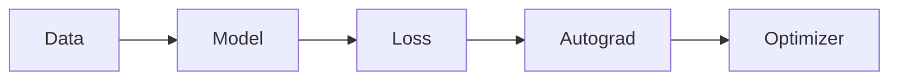

# Documentation style

Riftco Transformer documentation is organized by reader intent, following the
same broad separation used by mature infrastructure and language projects:
learn through a guided path, complete a task with a how-to, understand a design
through concepts and explanations, and look up exact behavior in reference
pages.

This page is the authoring contract for `README.md`, `docs/*.md`, and their
records in `site/docs_manifest.json`.

## Start with the reader's intent

Every guide has one primary section and one content type. A page may link to
other types, but it should not try to serve all of them at once.

| Type | Reader's question | Required shape |
| --- | --- | --- |
| Overview | “What is this area and where do I go?” | Scope, map, boundaries, next links |
| Tutorial | “Can you teach me by helping me build something?” | Prerequisites, sequential steps, observable outcome, completion check |
| How-to | “How do I accomplish this specific task?” | Preconditions, concise procedure, verification, failure cases |
| Concept | “How does this idea work?” | Mental model, invariants, examples, connections |
| Reference | “What is the exact contract?” | Complete names, signatures or options, defaults, validation, compatibility |
| Explanation | “Why is the system designed this way?” | Context, trade-offs, alternatives, consequences |

A tutorial may explain enough theory to complete the exercise, then link to a
concept page for depth. A reference page should not make readers work through a
tutorial to discover a default value.

## Use the section taxonomy

The site navigation has eight primary sections:

1. **Get started** — orientation, installation, and first success.
2. **Learn** — a progressive path through tensors, gradients, layers,
   attention, transformers, and training.
3. **How-to guides** — focused operational procedures such as fine-tuning,
   serving, checkpointing, and troubleshooting.
4. **Concepts** — architecture, lifecycle, optimization, tokenization, and
   evaluation mental models.
5. **Reference** — exact public APIs, configuration, CLI, and terminology.
6. **Internals** — source boundaries, dispatch, compiler, and extension seams.
7. **Experiments** — protocols, datasets, results, interpretation, and limits.
8. **Contribute** — roadmap, code contribution, and documentation rules.

Assign a guide to the section that best matches the reader's reason for opening
it. Cross-link related pages rather than duplicating a guide into several
sections.

## Required page structure

Begin with one level-one heading and a direct introduction. The first paragraph
should answer what the page helps the reader do or understand and should state
the important scope boundary.

Use only the subsections needed by the content type. The following templates
are defaults, not mandatory filler.

### Tutorial template

```markdown
# Build the thing

State the outcome and learning goal.

## What you will build
## Before you begin
## 1. First observable step
## 2. Next observable step
## Verify the result
## Understand what happened
## Next steps
```

Tutorial steps should form one runnable path. Do not branch into every backend
or configuration variant; link to how-to and reference pages for those.

### How-to template

```markdown
# Configure the thing

State the task and its boundary.

## Before you begin
## Configure
## Run
## Verify
## Troubleshoot
## Related guides
```

Assume the reader already understands the underlying concept. Keep the
procedure goal-oriented.

### Concept or explanation template

```markdown
# The concept

Give the shortest useful mental model.

## Why it exists
## Dataflow or invariants
## Concrete example
## Design boundary
## Limitations
## Related guides
```

Prefer a small worked example over a collection of abstract definitions.

### Reference template

```markdown
# Area reference

State the version and surface covered.

## Contract summary
## Names and signatures
## Defaults
## Validation and errors
## Compatibility or stability
## Source of truth
```

Reference tables should be exhaustive for their stated scope. If generation is
not available, link to the owning public headers or Python modules and name the
coverage boundary.

## Write source-grounded claims

Documentation must distinguish four kinds of evidence:

| Evidence | Acceptable wording |
| --- | --- |
| Source exists and is wired into a build | “The source build includes…” |
| Tests exercise a no-device or fake-device path | “CI covers compilation and unavailable-device behavior…” |
| A real hardware path was run | “Validated on…” with the device and configuration |
| Performance was measured | “Measured…” with workload, build, metric, and comparison |

Do not collapse these into “supported” without qualification. For example, the
TPU adapter is an experimental Linux x86-64 source path with fake-PJRT test
coverage; real Cloud TPU validation remains pending. That is more useful than
either hiding the adapter or calling it production-ready.

Apply the same rule to experiments:

- identify train, validation, probe, and test splits;
- state the seed count;
- say whether a number is a smoke result, a local experiment, or a reproduction;
- record the hardware and configuration for performance or memory numbers;
- keep observational analysis separate from causal interventions; and
- do not generalize beyond the dataset and protocol that were measured.

## Separate current behavior from future work

Use present tense only for an implemented, tested contract. Use explicit
labels for other states:

- **Stable** — public behavior intended for normal use and covered by the
  project's compatibility expectations.
- **Experimental** — implemented behavior whose interface, backend coverage,
  or real-hardware evidence is incomplete.
- **Active** — a roadmap or research area that combines completed slices with
  named future work.

Avoid vague promises such as “coming soon.” Name the missing acceptance test or
evidence milestone instead.

## Use terminology consistently

Prefer the project's exact terms:

| Use | Avoid when the distinction matters |
| --- | --- |
| decoder-only transformer | “the AI” or “the network” |
| model width | feature count, embedding dimension used inconsistently |
| attention head | feature head |
| token ID | token when referring specifically to the integer |
| logits | probabilities before softmax |
| gradient | loss rate of change with respect to a value |
| cross-entropy | gradient |
| backend adapter | kernel space or client/server layer |
| CPU reference implementation | fallback as a synonym for incorrect or secondary |
| post-training | evaluation |
| held-out test evaluation | proof of generalization |
| `ModelSnapshot` | persisted artifact |
| `ModelBundle` | resumable training checkpoint |

The [Glossary](GLOSSARY.md) owns short canonical definitions. Concept pages own
the deeper explanation.

## Make shapes and ownership visible

Shapes are part of the API. Write them in a consistent order and define every
symbol near first use:

```text
token IDs       [B, T]
hidden state    [B, T, D]
attention score [B, H, T, T]
logits          [B, T, V]
```

Use `B` for batch, `T` for time, `D` for model width, `H` for head count, `F`
for feed-forward width, and `V` for vocabulary unless a page explicitly needs
another convention.

State who owns state and who mutates it. “Adam updates the model” is less
precise than “Adam consumes registered leaf gradients and transactionally
replaces parameter values.”

## Write runnable commands

Introduce the assumed working directory. Prefer a complete command that a
reader can paste:

```bash
cmake --preset debug
cmake --build --preset debug
ctest --preset debug
```

Use `bash` for portable shell examples and `powershell` when syntax is specific
to Windows PowerShell. Do not use shell prompts such as `$`; they interfere
with copying. Use placeholders in uppercase and explain them before the code
block.

Show expected output only when it is deterministic and meaningful. Use an
ellipsis for variable detail, never a fabricated benchmark number.

## Write code examples against public surfaces

- Prefer installed public headers below `include/riftco_transformer/` over
  private `src/` headers.
- Prefer exported CMake targets such as `riftco_transformer::library` over a
  hard-coded archive path.
- In Python, use context managers for native resource lifetimes.
- Include required imports and state the framework version when compatibility
  matters.
- Keep examples small enough that a reader can identify every tensor shape and
  ownership transition.
- Do not catch an exception unless the handling itself is the subject of the
  example.

If a snippet is illustrative rather than directly runnable, say so before the
block.

## Use links as part of the information architecture

Link between documentation pages with paths relative to the current Markdown
file:

```markdown
[Autograd](AUTOGRAD.md)
[Architecture](ARCHITECTURE.md#training-boundary)
```

Use descriptive link text; avoid “click here.” Link once where the relationship
becomes useful rather than repeating the same destination in every paragraph.

The site generator rewrites repository Markdown links into page routes and
validates local destinations and anchors. Do not hand-code generated `.html`
routes inside `docs/*.md`.

For external material, link to a primary source: an official specification,
project documentation, or research paper. Summarize it in original language
and keep quoted text short.

## Use diagrams only for relationships

Mermaid is appropriate when a sequence, dependency direction, or branching
flow is harder to understand in prose:



Use a table for exact mappings and a short list for independent items. Every
diagram needs a sentence before or after it that states the important
relationship; do not make color the only carrier of meaning.

## Write renderer-safe math

Use `$...$` for inline math and fenced `math` blocks for display equations:

````markdown
```math
\mathbf{y} = \mathbf{x}\mathbf{W}^{\mathsf{T}} + \mathbf{b}.
```
````

Use the MathJax-supported subset checked by
`.github/scripts/check_docs_math.py`. Prefer `\mathrm{}` for textual operators.
Avoid unsupported commands and avoid placing raw dollar amounts next to math
delimiters.

Define symbols in prose immediately before or after an equation. An equation
without the meaning of its variables is not complete documentation.

## Make pages accessible and scannable

- Use one `#` heading, then nest headings without skipping levels.
- Keep headings descriptive and unique within the page.
- Put a blank line around lists, tables, and fenced blocks.
- Give tables a header row and avoid using them for long prose.
- Introduce code blocks and diagrams in the surrounding text.
- Use meaningful text instead of relying on color or spatial position.
- Expand uncommon abbreviations at first use.
- Prefer short paragraphs and active voice.

The first sentence under a heading should carry information; avoid throat
clearing such as “In this section, we will discuss…”

## Register every guide in the manifest

`site/docs_manifest.json` is the navigation and metadata source of truth. Each
guide record contains:

| Field | Meaning |
| --- | --- |
| `source` | Repository Markdown path |
| `section` | One primary section ID |
| `type` | One of the six content types |
| `order` | Position within the primary section |
| `summary` | One-sentence outcome or scope |
| `stability` | `Stable`, `Experimental`, or `Active` |
| `backends` | Backends covered, or `Backend-neutral` |
| `audience` | Intended reader groups |

Every `README.md` or `docs/*.md` page must appear exactly once. Section IDs and
guide sources must resolve, and array values must be non-empty and unique.

When a guide moves section, update only its primary manifest record and repair
contextual links where necessary. Do not copy the Markdown file to manufacture
a second navigation entry.

## Review checklist

Before publishing documentation, verify:

- [ ] The page serves one primary reader intent.
- [ ] The title and first paragraph state the outcome and scope.
- [ ] Present-tense claims are implemented and source-grounded.
- [ ] Hardware and performance claims name their evidence.
- [ ] Future work is separated from current behavior.
- [ ] Shapes, defaults, ownership, and invalid cases are explicit where
      relevant.
- [ ] Commands state their working-directory assumptions and are copyable.
- [ ] Code uses public interfaces unless internals are the subject.
- [ ] Links are descriptive, relative, and valid.
- [ ] Math uses supported syntax and defines its symbols.
- [ ] The page has exactly one manifest record.
- [ ] Documentation math and generated-site checks pass.
