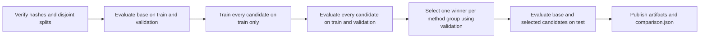

# Post-Training Generalization

Generalization asks whether a tuned model improves on examples that never
updated its weights. A falling optimizer loss answers a different question:
whether the model fits the sampled training batches.

Riftco Transformer applies one generalization contract to full fine-tuning,
LoRA, and QLoRA. The same native model and evaluation contracts run on
CPU, Metal, or optional source-built CUDA and TPU backends; Python is an
orchestration surface over that C++ runtime, not a separate PyTorch, JAX, or
TensorFlow implementation.

## What is measured

The evaluator exhaustively scores each usable next-token target once and
weights the mean by target-token count. It reports loss and perplexity:

$$
\mathrm{PPL} = e^{L}
$$

Lower loss and perplexity are better. The generalization gaps compare the
same exhaustive metric on training and held-out data:

$$
G_{\mathrm{validation}} =
L_{\mathrm{validation}} - L_{\mathrm{train}}
$$

$$
G_{\mathrm{test}} = L_{\mathrm{test}} - L_{\mathrm{train}}
$$

For a trained candidate and comparable, independently sampled splits, a large
positive gap can be evidence of overfitting. It can also reflect a harder or
shifted held-out distribution; the baseline gap is useful context, not evidence
that the unchanged base overfit this training run. A small gap alone is not
enough: train and test losses could both be poor. Read held-out loss, the tuned
gap, and the baseline gap together.

The report also compares each tuned artifact with the immutable base:

$$
\Delta L_{\mathrm{split}} =
L_{\mathrm{tuned,split}} - L_{\mathrm{base,split}}
$$

A negative delta is an improvement. The final sampled minibatch loss is not
used for these gaps because it is not comparable with exhaustive held-out
evaluation.

## Leakage-safe sequence



Full fine-tuning is one fixed candidate. LoRA or QLoRA ranks can form a
selection group, so only the lowest-validation-loss rank receives a final test
score. Candidate declaration order breaks exact ties; the supplied Full-versus-
LoRA CLI declares ranks in ascending order, while the Python API accepts QLoRA
candidates directly. No test forward pass occurs until every group winner is
fixed.

Reporting test results for both the fixed full recipe and the selected LoRA
recipe consumes the test split for a final method comparison. Retire that test
split afterward: do not change hyperparameters based on its result and run the
same test again.

## Compare full fine-tuning with LoRA

Prepare a verified instruction dataset as described in
[Datasets and LoRA experiments](DATASETS_AND_LORA_EXPERIMENTS.md), then run:

```bash
PYTHONPATH=python:. python3 -m labs.fine_tuning.run \
  --base results/stages/tinystories_pretrained.rift \
  --data data/external/huggingface/dolly-lora-v1 \
  --output runs/fine-tuning \
  --methods full,lora \
  --lora-ranks 1,2,4,8 \
  --alpha-over-rank 2 \
  --steps 50 \
  --context 32 \
  --batch-size 4 \
  --full-learning-rate 0.001 \
  --lora-learning-rate 0.005 \
  --backend metal
```

Use `--backend cpu` on other systems. The two learning rates are separate
because full fine-tuning and LoRA often have different useful ranges. This
command compares the exact recipes supplied; one run cannot establish which
method is intrinsically best.

A CUDA-enabled source build can run the same comparison with
`--backend cuda`; no experiment or metric implementation changes. Build it
with CUDA Toolkit 12+ and
`-DRIFTCO_TRANSFORMER_ENABLE_CUDA=ON`. Standard wheels recognize the `cuda`
name but contain its unavailable stub. CUDA tensors use managed memory; NN
operations, loss, matmul, packed NF4 linear forward/input backward,
materialized/Flash attention and their VJPs, paged decode, and Adam's
candidate-state update use native CUDA kernels. Adam's global gradient norm and
graph traversal remain host control flow. CUDA is therefore a functional
backend for Full, LoRA, and QLoRA generalization experiments, not evidence of a
fully device-resident graph or an end-to-end speedup. Its packed path is
implemented, but actual NVIDIA-hardware validation was not available on this
macOS host. Keep one backend fixed across candidates in a comparison.

A TPU-enabled Linux x86-64 source build can likewise use `--backend tpu` with
a compatible `libtpu.so` and an addressable Google Cloud TPU device. Its
PJRT/StableHLO path runs packed NF4 linear forward/input backward, matmul,
materialized attention and its VJPs, and paged decode; evaluation, loss, Flash
attention, Adam, and other capabilities run through audited reference paths
over host-mirrored storage. Full, LoRA, and QLoRA comparisons are functionally
wired, but real-hardware validation is pending and selecting TPU is not yet a
performance claim. Standard wheels expose the stable name through ABI 2.5 but
contain its unavailable stub. Keep one resolved backend for every candidate in
a comparison.

The output directory is published atomically and contains:

- one merged, serving-ready `.rift` artifact for every candidate;
- `comparison.json` with the verified data manifest and split fingerprints;
- exhaustive base, train, validation, and selected test measurements;
- parameter counts, trainable fractions, deltas, and generalization gaps; and
- the selection policy and selected candidate names.

Unselected rank trials deliberately have `null` test fields. The report marks
the test split as consumed. The CLI refuses to replace an existing output
directory, preserving prior evidence.

## Python lab API

`FineTuningCandidate` wraps an ordinary `PostTrainingConfig`. Candidates use
their fine-tuning method as the default selection group. These protocol types
live in the source-only lab, not the installed `riftco_transformer` package:

```python
from riftco_transformer import LoraConfig
from labs.fine_tuning import (
    FineTuningCandidate,
    FineTuningExperimentConfig,
    compare_fine_tuning,
    load_prepared_instruction_splits,
)
from riftco_transformer.post_training import PostTrainingConfig

splits = load_prepared_instruction_splits("prepared/dolly")
candidates = (
    FineTuningCandidate(
        "full",
        PostTrainingConfig(fine_tuning_method="full"),
    ),
    FineTuningCandidate(
        "lora-rank-4",
        PostTrainingConfig(
            fine_tuning_method="lora",
            lora=LoraConfig(rank=4, alpha=8.0),
        ),
    ),
    FineTuningCandidate(
        "qlora-rank-4",
        PostTrainingConfig(
            fine_tuning_method="qlora",
            double_quantization=True,
            optimizer_state="auto",
            lora=LoraConfig(rank=4, alpha=8.0),
        ),
    ),
)

comparison = compare_fine_tuning(
    base_bundle,
    splits,
    FineTuningExperimentConfig(candidates=candidates),
)
```

QLoRA's automatic optimizer state resolves to bounded pages, and its base
weights stay packed during optimizer training. Post-training then merges the
adapter and exports the ordinary FP32 bundle; exhaustive train/validation/test
evaluation scores that serving-ready artifact. Paging does not reduce the two-
FP32-moment payload; CUDA pages use managed memory but there is no OS spill or
page-fault manager.

Reusable split types and the read-only evaluator live in
`riftco_transformer.post_training`, because split integrity and held-out
scoring are framework capabilities rather than LoRA-specific policy. Candidate
construction, group selection, and reporting live in `labs.fine_tuning`.
`labs.lora_rank` provides the focused rank-only protocol. C++ supplies the
model/loss/autograd/Adam operations used by both labs; it does not own a
candidate-sweep or held-out-selection orchestrator.

## What this does not prove

The current objective is `full_sequence_causal_sft`. Prompt text, delimiters,
and response text all contribute to loss; it is not response-only instruction
loss. A same-source Dolly test estimates in-distribution generalization, not:

- factual accuracy or human preference;
- safety, calibration, or adversarial robustness;
- performance on a new domain or task family; or
- statistical stability across seeds.

Choose learning rates, ranks, steps, and seeds using training and validation
only. After those choices are frozen, run one final test comparison. Broader
claims require separate task metrics, out-of-distribution datasets, human
evaluation, and repeated runs with uncertainty estimates.

Leakage checks reject exact prompt/response duplicates and inputs that become
exactly equal after formatting. They do not detect paraphrases, shared source
documents, or semantic near-duplicates; use source/group-aware data splitting
and a separate deduplication pass when those risks exist.
