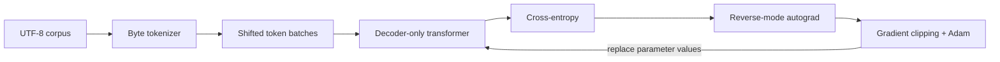

# Getting started

This guide takes you from a clean machine to a verified Riftco Transformer
installation. It intentionally uses the small CPU path first. Once that path
works, you can select Metal or build the optional CUDA and TPU adapters without
changing the model API.

## Choose an installation path

Use the Python package when you want to explore the public model, training, and
serving APIs. Build from source when you want to read or modify the C++
implementation.

| Goal | Start here | What you need |
| --- | --- | --- |
| Try the framework | Python wheel | Python 3.10 or newer |
| Study or change the implementation | C++ source build | CMake 3.24+, Ninja, and a C++20 compiler |
| Use Apple Metal | macOS source build or macOS wheel | A compatible Apple device |
| Use NVIDIA CUDA | CUDA-enabled source build | CUDA Toolkit 12+, a compatible driver, and an NVIDIA GPU |
| Explore the TPU adapter | TPU-enabled source build | Linux x86-64, `libtpu.so`, and an addressable Cloud TPU device |

CPU is the complete readable reference path and is available in every build.
Metal is included by default on Apple source builds. CUDA is opt-in, and the
TPU adapter remains experimental; real Cloud TPU validation is still pending.
See [Execution backends and the Python ABI](BACKENDS_AND_PYTHON.md) before
interpreting an accelerator selection as a performance claim.

## Install the Python package

Create a virtual environment so the experiment is isolated from other Python
projects:

```bash
python3 -m venv .venv
source .venv/bin/activate
python3 -m pip install --upgrade pip
python3 -m pip install riftco-transformer
```

On Windows PowerShell, activate the environment with:

```powershell
.venv\Scripts\Activate.ps1
```

Verify the native runtime carried by the wheel:

```bash
python3 -c "from riftco_transformer import Context; print(Context('cpu').backend)"
```

Expected output:

```text
cpu
```

The released wheel has no third-party Python runtime dependencies. It carries
the C ABI library used by the standard-library `ctypes` client. Standard wheels
always include CPU; macOS wheels also include Metal. CUDA and TPU require the
explicit source builds described in
[Execution backends and the Python ABI](BACKENDS_AND_PYTHON.md).

## Run one transparent tensor calculation

The smallest useful program creates two tensors and multiplies them. Resource
objects support Python context managers, so the example makes their native
lifetime explicit:

```python
from riftco_transformer import Context, Tensor

with Context("cpu") as context:
    with Tensor.from_data(context, (1, 2), (3.0, 4.0)) as left:
        with Tensor.from_data(context, (2, 1), (5.0, 6.0)) as right:
            with left.matmul(right) as result:
                print(result.shape)
                print(result.tolist())
```

Expected output:

```text
(1, 1)
[39.0]
```

The result is $3 \times 5 + 4 \times 6 = 39$. This is the same tensor storage
and checked matrix-multiplication contract used inside a transformer. Continue
with [Tensor storage](TENSOR.md) and [Tensor operations](TENSOR_OPS.md) if you
want to understand the layout before training a model.

## Build the C++ project

Clone and enter the repository:

```bash
git clone https://github.com/quangng2000/riftco-transformer.git
cd riftco-transformer
```

Configure, build, and test the debug preset:

```bash
cmake --preset debug
cmake --build --preset debug
ctest --preset debug
```

A successful run ends with all configured tests passing. The default preset
builds the native framework libraries, C ABI, install checks, and Python
binding/workflow tests. On supported Apple systems, it also compiles the Metal
adapter; CPU remains the selected execution backend unless a caller requests
another one. Research labs are Python source modules rather than CMake targets.

### If configuration fails

- Confirm that `cmake --version` reports 3.24 or newer.
- Confirm that `ninja --version` succeeds.
- Confirm that the selected compiler supports C++20.
- Remove assumptions about CUDA or TPU from the first build. Both are explicit
  opt-in configurations.

For common failure signatures, see [Troubleshooting](TROUBLESHOOTING.md).

## Run a short training smoke test

Python owns the readable training loop. Run five CPU steps through the public
package and native engine:

```bash
PYTHONPATH=python python3 examples/python/train_tiny.py \
  --steps 5 --backend cpu
```

The command reports the corpus size, vocabulary, parameter count, selected
backend, attention algorithm, checkpointing policy, loss, validation loss,
gradient norm, and clipping scale.

This run is a wiring check, not evidence of language-model quality. The tiny
dataset and short schedule are designed to make the forward pass, autograd,
cross-entropy, and Adam update visible. See [Training loop](TRAINING.md) for the
meaning of each metric.

## Select an available backend

The same Python example accepts a backend name explicitly:

```bash
PYTHONPATH=python python3 examples/python/train_tiny.py \
  --steps 5 --backend metal
```

Use `metal` only on a build with an available Metal adapter. CUDA and TPU need
their respective source configurations. An explicitly unavailable backend
fails rather than silently moving the run to CPU, which protects experiment
comparability.

High-level Python stage configurations additionally accept `"auto"`. That
policy prefers an available TPU, then CUDA, Metal, and CPU. Use an explicit
backend for reproducible comparisons.

## Understand what you just ran

The training path crosses these framework boundaries:



Each box is separately testable. The transformer returns logits; it does not
own the loss or optimizer. Autograd computes gradients; Adam consumes them.
That separation is central to the project rather than incidental plumbing.

## Pick your next guide

| If you want to… | Continue with… |
| --- | --- |
| Build the model one layer at a time | [Build a transformer from scratch](TUTORIAL_BUILD_TRANSFORMER.md) |
| Understand the overall boundaries first | [Architecture](ARCHITECTURE.md) |
| Follow tensor shapes through attention | [Causal self-attention](ATTENTION.md) |
| Run pretraining, post-training, and serving | [Staged model pipeline](PIPELINE.md) |
| Fine-tune with adapters | [LoRA](LORA.md) or [QLoRA](QLORA.md) |
| Contribute an operation or backend | [Contributing](CONTRIBUTING.md) |

## Completion check

You are ready for the learning guides when all of these are true:

- the CPU context or debug build initializes successfully;
- the tensor example returns `[39.0]` or the native test suite passes;
- the short Python run reports at least one finite loss; and
- you understand that the smoke test validates integration, not
  generalization or production readiness.
