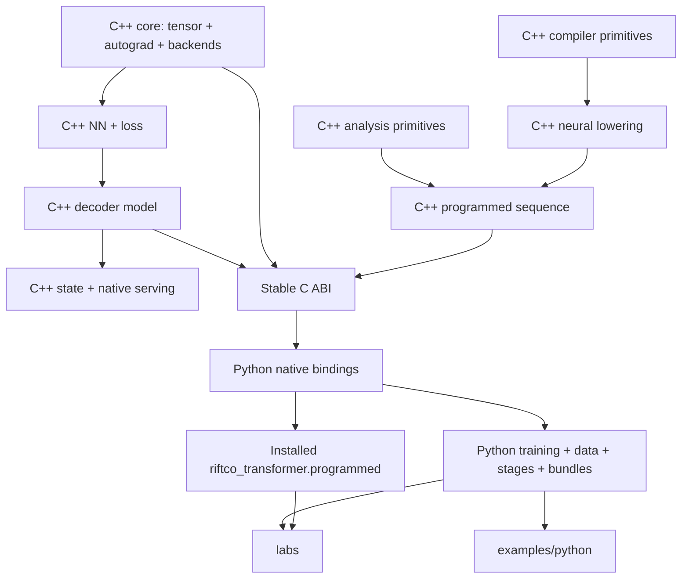

# Project Structure

The repository separates a reusable native execution engine from Python-owned
workflow and research policy. That boundary keeps numerical code portable and
auditable without turning one experiment into framework API.

## Ownership rule

| Concern | Owner | Examples |
| --- | --- | --- |
| Numerical execution | C++ framework | tensors, autograd, modules, transformer, loss, Adam, NF4, backends |
| Reusable model/runtime state | C++ framework | tokenizer state, `ModelSnapshot`, native generation, KV cache |
| Symbolic and interpretation primitives | C++ framework | Cajal compiler, neural lowering, generic program-augmented composition, PCA/ablation helpers |
| Stable language boundary | C ABI | opaque handles and size-versioned structures used by `ctypes` |
| Workflow policy | installed Python package | datasets, batches, training loops, pretraining, post-training, evaluation, bundles, HTTP serving |
| Small usage demonstrations | `examples/python/` | one readable training run and three-stage artifact flow |
| Research policy | top-level `labs/` | hypotheses, candidate sweeps, fixed seeds, held-out selection, reports |

Labs are source-checkout modules. They are not included in the wheel, installed
headers, exported CMake targets, or stable API promise. Generated lab output
belongs under ignored `runs/`; only small reviewed evidence records belong in a
lab's `reports/` directory.

## Dependency direction



Arrows point from a consumer to the lower-level capability it uses. In
particular:

- `core` does not depend on `nn`, `model`, Python, or a research task;
- `model` does not own datasets, loss selection, optimizer loops, or serving
  policy;
- C++ serving does not depend on training or optimizer orchestration;
- Python binds the C ABI, never a C++ object layout; and
- labs import public Python framework APIs, not internal C++ headers or private
  binding details.

## Native C++ layout

Public declarations live under `include/riftco_transformer/`; implementations
mirror them under `src/`:

```text
include/riftco_transformer/
├── core/                 tensor, operations, autograd, quantized weights
├── nn/                   parameters, modules, layers, activation, loss, LoRA
├── model/                attention, blocks, decoder-only transformer, KV API
├── optim/                Adam and optimizer-state policies
├── data/                 tokenizer and token-batch representations
├── artifacts/            in-memory model/tokenizer state
├── stages/serving/       reusable in-process generation composition
├── compiler/cajal/       finite typed AST, checker, evaluator, compiler
├── lowering/             compiler-to-neural bridge
├── programmed/           sequence placement and generic ProgramAugmentedModel
├── analysis/             PCA, interventions, and ablation statistics
└── c_api.h               stable C boundary

src/
├── core/
│   ├── tensor/           Tensor implementation details
│   ├── autograd/         graph, operations, checkpoint/custom-gradient details
│   ├── quantization/     NF4 packing and quantized-weight storage
│   └── backend/          capability contracts, dispatch, and adapters
├── nn/
├── model/
├── optim/
├── data/
├── artifacts/
├── stages/serving/
├── compiler/cajal/
├── lowering/
├── programmed/
├── analysis/
└── c_api.cpp
```

There is intentionally no native pretraining stack, post-training stack,
training CLI, or task-specific conditional-reversal library. C++ does expose
the task-neutral `ProgramAugmentedModel`, time-range loss, autograd, and Adam
primitives; F/P/T/I construction, loops, evaluation, and reports remain
canonical in Python.

### Header and implementation pairing

An `.hpp` file declares the public contract a consumer compiles against. A
matching `.cpp` file owns non-template implementation details. This pairing:

- keeps dependencies visible at the interface;
- prevents implementation helpers from becoming accidental API;
- reduces recompilation when implementation changes; and
- allows readable CPU code and accelerator dispatch to share one contract.

Private helpers belong under `src/**/detail/` or in an unnamed namespace, not
under public `include/`.

## Backend organization

Backend code is split by capability first and hardware second:

```text
src/core/backend/
├── adapters/
│   ├── cpu/
│   ├── metal/
│   ├── cuda/
│   └── tpu/
├── attention/
│   ├── reference/
│   ├── metal/
│   ├── cuda/
│   └── tpu/
├── nn/
│   ├── reference/
│   ├── metal/
│   ├── cuda/
│   ├── tpu/
│   └── quantized_linear/
└── optim/adam/
```

The readable reference implementation is the correctness oracle. Dispatch
validates a backend-neutral request, then selects an available capability.
Hardware directories implement that contract without leaking CUDA, Metal, or
PJRT types into tensors, neural layers, Adam, or Python.

This separation supports extension without copying whole algorithms into every
backend. A new kernel normally changes one capability contract/dispatcher,
one reference test, and the hardware implementation that benefits from it.

## Python distribution

```text
python/riftco_transformer/
├── native/          typed `ctypes` wrappers over opaque C handles
├── programmed/      generic multilinear-map and learned/programmed model API
├── training/        batches, trainer loop, metrics, backend selection
├── pretraining/     next-token workflow and immutable base bundle creation
├── post_training/   Full/LoRA/QLoRA workflow and held-out evaluation
├── data/            preparation, adapters, splitting, verification
├── artifacts/       versioned `.rift` `ModelBundle`
└── serving/         sampling, model service, chat, and local HTTP
```

The package is dependency-free by default. Python owns mutable workflow state
only for the duration of a run; numerical forward/loss/backward/Adam calls
execute in the native engine. The wheel contains this package and the matching
C ABI shared library, but not repository labs.

## Examples and labs

```text
examples/python/
├── train_tiny.py
├── prepare_huggingface_data.py
├── pretrain_stage.py
├── post_train_stage.py
└── serve_stage.py

labs/
├── _support/             shared report publication helpers
├── lora_rank/            controlled LoRA-rank selection
├── fine_tuning/          full-versus-LoRA comparison
└── conditional_reverse/  F/P/T/I study, interpretation, and evidence policy
```

An example answers “how do I call this public API?” A lab answers “what fixed
hypothesis and evidence protocol are we testing?” If code selects candidates,
owns train/validation/test policy, performs ablations, or publishes a research
report, it belongs in `labs/`.

Run labs from the repository root:

```bash
PYTHONPATH=python:. python3 -m labs.lora_rank.run --help
PYTHONPATH=python:. python3 -m labs.fine_tuning.run --help
PYTHONPATH=python:. python3 -m labs.conditional_reverse.run --help
```

The conditional-reversal lab composes `riftco_transformer.programmed` and owns
deterministic data, sparse F/P/T/I specifications, training/evaluation policy,
PCA, ablations, steering, and reports. The generic C++/C ABI/Python path is
implemented without creating a task-specific native library. One archived
record under `labs/conditional_reverse/reports/` preserves the retired native
prototype's provenance, while two reviewed records cover the current ABI 2.5
QUICK and paper-F paths. None is current multi-seed reproduction evidence.

## State handoffs

Two state contracts remain intentionally different:

| Contract | Owner | Purpose | Persistent | Resumable training |
| --- | --- | --- | --- | --- |
| `ModelSnapshot` | C++ | in-process model/tokenizer state, including native serving restore | No | No |
| `ModelBundle` | Python | immutable, checksummed stage handoff and distribution | Yes (`.rift`) | No |

Neither stores Adam moments, optimizer step, sampler position, or random state.
A future exact `TrainingCheckpoint` is a separate contract.

## Tests

```text
tests/
├── core/          tensor, autograd, quantization, backend dispatch
├── nn/            layers, loss, LoRA
├── model/         attention, transformer, decode
├── optim/         Adam equations, paging, transactionality
├── data/          tokenizer and batches
├── artifacts/     state capture/restore
├── stages/        native serving
├── compiler/      Cajal checker/evaluator/compiler equivalence
├── lowering/      neural lowering
├── programmed/    sequence core and generic program-augmented model
├── analysis/      PCA and interventions
├── abi/           stable C boundary
├── package/       installed CMake consumers
└── python/        bindings and Python-owned workflows

labs/*/tests/      source-only research protocol tests
```

Tests belong at the lowest contract they protect. Accelerator integration is
compared with the CPU oracle; compilation or an unavailable-device stub is not
reported as real-hardware validation.

## CMake organization

The installed package exports these concerns separately:

| Target | Purpose |
| --- | --- |
| `riftco_transformer::library` | native tensor/model/optimizer/artifact/serving runtime |
| `riftco_transformer::compiler` | standard-library-only Cajal frontend/compiler |
| `riftco_transformer::analysis` | standard-library-only interpretation primitives |
| `riftco_transformer::lowering` | one-way compiler-to-neural bridge |
| `riftco_transformer::programmed` | generic programmed sequence and learned-model composition |
| `riftco_transformer::c_api` | shared stable ABI 2.5 used by Python, including programmed handles |

`cmake/RiftcoTransformerBackends.cmake` owns hardware options;
`RiftcoTransformerWarnings.cmake` and `RiftcoTransformerSanitizers.cmake` own
toolchain policy; `RiftcoTransformerInstall.cmake` owns package export and
wheel-library placement. No experiment target is exported.

## Extension checklist

Before adding a component, ask:

1. Is it reusable numerical/model behavior? Put its contract in C++ and expose
   only the necessary stable C operation to Python.
2. Is it dataset, loop, evaluation, or workflow policy? Put it in the installed
   Python package.
3. Is it a controlled hypothesis, sweep, ablation, or report? Put it in
   top-level `labs/` and import only public Python APIs.
4. Is it a small usage demonstration? Put it in `examples/python/`.
5. Does it require a new hardware path? Add a reference contract first, then a
   capability-specific backend implementation and oracle comparison.

These rules preserve separation of concerns and make framework features
reusable without making experiments permanent dependencies.
