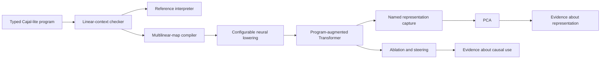

# Research Portfolio: Neuro-Symbolic Learning and Compiled Transformers

**Quang T. Nguyen**

[GitHub](https://github.com/quangng2000) ·
[Riftco Transformer](https://github.com/quangng2000/riftco-transformer)

My research interest is neuro-symbolic artificial intelligence: learning
systems that combine the adaptability of neural networks with the explicit,
compositional structure of programs. I am particularly interested in how a
system can discover reusable symbolic abstractions, compile them into neural
computation, and expose enough internal structure to test whether it is using
the intended algorithm.

This portfolio is grounded in implemented source, tests, and archived
experiment records. It distinguishes completed engineering, measured research
evidence, and future aspirations. I do not claim education, employment,
institutional affiliation, or results that are not established by the linked
artifacts.

## Research direction

My central question is:

> Can a learning system acquire its own language of reusable programs, use a
> neural model to search that language efficiently, and compile the resulting
> programs into inspectable neural components?

This question connects programming-language semantics, program synthesis,
transformer architectures, and mechanistic interpretability. I am exploring
five related problems:

1. How can a neural recognition model guide search over typed programs?
2. How can solved tasks be compressed into reusable symbolic primitives?
3. When can a symbolic program be lowered exactly into differentiable neural
   computation?
4. How can ablations and interventions verify that a composed model relies on
   the compiled computation?
5. Does a learned symbolic library improve sample efficiency and
   compositional generalization on held-out task families?

## Background and motivation

I approached these questions by building the relevant stack from first
principles. Riftco Transformer is a C++20 execution engine with dependency-free
Python workflows. It includes tensors, reverse-mode automatic differentiation,
causal attention, transformer blocks, cross-entropy, Adam, LoRA and QLoRA,
checkpointing, serving primitives, and backend boundaries. Building the
runtime made the numerical assumptions beneath neural experiments explicit
rather than leaving them inside a large external framework.

I then added a symbolic compiler and a one-way bridge into neural execution.
This created an environment in which a reference interpreter, a compiled map,
and a differentiable module can be compared directly. The same environment
captures named representations and supports PCA, ablation, and steering as a
separate analysis stage.

## Riftco Transformer as a research artifact



The boundaries are deliberate. The symbolic compiler does not depend on the
tensor runtime. Neural lowering depends one way on the compiler and runtime.
Python owns datasets, experimental variants, model-selection policy, and
reports. This separation keeps the semantics independently testable and keeps
task-specific claims out of the reusable framework.

## Selected technical contributions

| Area | Implemented contribution | Research relevance |
| --- | --- | --- |
| Symbolic language | An immutable Cajal-inspired AST with finite unit, sum, product, and dictionary types; variables, binding, sequencing, case analysis, projection, and lookup | Provides an auditable language for finite structured computation |
| Static semantics | A linear-resource checker that distinguishes additive alternatives from multiplicative composition | Preserves the multilinear interpretation required by the compiler |
| Dynamic semantics | A deterministic checked interpreter and finite-value encoder/decoder | Supplies a reference oracle for compiled execution |
| Compiler | Recursive lowering of checked expressions to dense multilinear maps | Turns symbolic programs into explicit numerical operators |
| Neural lowering | Exact dense contraction, unary linear maps, and bilinear identity-kernel linear attention, with frozen or trainable coefficients | Makes compiled computation differentiable and composable with learned modules |
| Model composition | A task-neutral `ProgramAugmentedModel` with learned projections, residual feed-forward paths, learned causal attention, sequence placement, and named traces | Supports controlled comparisons between programmed and learned computation |
| Interpretation | Standard-library PCA, paired ablation statistics, representation capture, batch-roll interventions, and affine steering | Separates observational representation analysis from causal tests |
| Transformer systems | C++ tensors, autograd, decoder-only attention, Adam, activation checkpointing, paged KV-cache generation, LoRA, and packed QLoRA | Provides a readable substrate for training and systems research |
| Portability | Stable C ABI and Python API, canonical model interchange, and CPU, Metal, optional CUDA, and experimental PJRT/TPU boundaries | Makes experiments reproducible across explicit execution contracts |

The central compiler implementation is documented in
[Compiling Programs to Transformers](COMPILING_TO_TRANSFORMERS.md). Its tests
compare interpreter results, compiled multilinear maps, and differentiable
lowered modules over representative finite programs.

## Experimental evidence

The conditional-string-reversal lab tests whether a compiled attention-like
component can be composed with learned paths and then identified through
intervention.

In one reviewed paper-profile `F` run on Apple Metal:

- the model reached **100% target-token accuracy** and **100% exact-sequence
  accuracy** on a source-disjoint 1,000-example test split after 790 Adam
  steps;
- reassigning the frozen compiled-program output across examples reduced token
  accuracy from 100% to 4.2%, an effect of **95.8 percentage points**; and
- the matched learned-attention reassignment produced no measured accuracy
  change in that run.

This is causal-necessity evidence for that specific trained model, not a proof
that every model will use the same mechanism. The PCA result is descriptive,
and the steering result provides limited causal-control evidence. The record is
one seed on one machine, not a multi-seed paper reproduction or a hardware
benchmark. The all-variant `F/P/T/I` quick run establishes end-to-end execution,
not comparative research performance.

The complete provenance, split policy, metrics, interventions, and native
library hash are preserved in the
[reviewed run record](../labs/conditional_reverse/reports/m4-max-metal-f-seed-42-abi-2.5.json)
and its [evidence notes](../labs/conditional_reverse/reports/README.md).

## DreamCoder-inspired research agenda

[DreamCoder](https://arxiv.org/abs/2006.08381) is the principal inspiration for
my next research stage. It combines symbolic program search, a learned neural
recognition model, reusable library induction, and wake-sleep refinement. My
current repository does **not** implement DreamCoder: it implements the
language, checking, compilation, differentiable execution, and analysis
infrastructure on which a related investigation can be built.

I intend to develop the next stage as a controlled research program:

1. **Task distribution.** Define finite compositional task families with held-
   out combinations and exact executable specifications.
2. **Symbolic baseline.** Implement typed enumerative search and measure search
   cost, solution length, and generalization without neural guidance.
3. **Recognition-guided search.** Train a transformer to predict useful types,
   primitives, or partial programs from task examples.
4. **Library learning.** Compress repeated solution structure into reusable
   primitives and compare fixed and learned libraries.
5. **Wake-sleep refinement.** Alternate solving observed tasks with training on
   replayed or generated tasks, while recording what knowledge enters the
   symbolic library and what remains amortized in the neural guide.
6. **Compiled composition.** Lower selected programs into differentiable
   modules and compose them with learned transformer paths.
7. **Causal evaluation.** Use held-out tasks, ablations, steering, and trace
   analysis to test both behavioral generalization and mechanistic reliance.

Primary outcomes would include exact task success, program-search efficiency,
library compression, sample efficiency, out-of-distribution compositional
generalization, and causal evidence about how the neural and symbolic
components interact.

## Research aspiration

My long-term goal is to build learning systems that acquire their own
interpretable languages of reasoning. Rather than receiving a fixed ontology,
such a system would discover abstractions through experience, express them as
programs, and reuse them on unfamiliar problems. The neural component would
provide flexible perception and amortized search; the symbolic component would
provide explicit composition, execution, and opportunities for verification.

I am especially interested in research where theory and implementation remain
connected: a language has stated semantics, a compiler has an executable
reference, a neural realization has gradient and equivalence tests, and an
interpretability claim is supported by a predeclared intervention rather than
only a visualization.

I am developing this research direction with guidance from **Dat Nguyen**. I
describe this relationship only as guidance; this page does not imply an
institutional affiliation or formal supervisory role.

## Current limitations

The limitations define the next research questions rather than hidden scope:

- Cajal-lite is a **first-order typed linear calculus inspired by lambda
  calculus and Cajal**, not a general lambda calculus. It has no function
  values, function types, closures, higher-order application, parser, or
  textual syntax.
- Compiler correctness is covered by representative equivalence and gradient
  tests, not a machine-checked formal proof.
- Sparse map import currently materializes a dense native coefficient tensor.
- Programmed linear attention is an exact identity-kernel bilinear contraction,
  not learned scaled-softmax Q/K/V attention.
- Neural-guided program search, wake-sleep learning, and automatic library
  induction are proposed work, not completed DreamCoder functionality.
- The archived conditional-reversal result is single-seed evidence; a credible
  comparative study still requires predeclared multi-seed `F/P/T/I` runs.
- The native Llama/Mistral work implements a dense reference topology, not
  external Hugging Face checkpoint or SentencePiece compatibility.
- ONNX import accepts canonical Riftco exports rather than arbitrary ONNX
  graphs.
- CUDA and real Cloud TPU hardware acceptance remain pending; the TPU evidence
  currently covers the Linux source boundary and fake PJRT protocol.

## Reproduce and inspect

Build and run the complete test suite:

```bash
git clone https://github.com/quangng2000/riftco-transformer.git
cd riftco-transformer
cmake --preset debug
cmake --build --preset debug
ctest --preset debug
```

Inspect the research components:

- [Compiler and language semantics](COMPILING_TO_TRANSFORMERS.md)
- [Compiler source](../src/compiler/cajal/)
- [Neural lowering source](../src/lowering/)
- [Programmed-model source](../src/programmed/)
- [Interpretability algorithms](../src/analysis/)
- [Conditional-reversal lab](../labs/conditional_reverse/)
- [Generalization protocol](GENERALIZATION.md)
- [Framework architecture](ARCHITECTURE.md)
- [Active roadmap](ROADMAP.md)

## Collaboration

I welcome discussion with researchers working on program synthesis,
neuro-symbolic learning, programming-language semantics, mechanistic
interpretability, and efficient neural systems. Reproducible issue reports,
adversarial reviews, and focused research proposals can be opened through the
[GitHub repository](https://github.com/quangng2000/riftco-transformer/issues).
