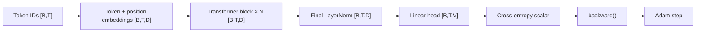

# Build a transformer from scratch

This tutorial connects the framework's small, inspectable components into one
decoder-only transformer training step. The goal is not to hide the model
behind a high-level trainer. You will identify every tensor shape, build the
model explicitly, calculate a scalar loss, run reverse-mode differentiation,
and let Adam update the parameters.

## What you will build

The final program implements this path:



The complete model class composes the primitives, but none of the mathematical
responsibilities disappear. The source remains divided into tensor,
autograd, neural-network, model, and optimizer layers so you can inspect each
stage independently.

## Before you begin

Complete the C++ source path in [Getting started](GETTING_STARTED.md). The
commands below assume a successful `debug` build from the repository root.

You should be comfortable with:

- a matrix shape such as `[rows, columns]`;
- the idea that a token ID selects a row from an embedding table; and
- a derivative as the rate at which a scalar loss changes when a parameter
  changes.

The linked concept guides fill in the details as you reach each component.

## 1. Fix the dimensions

Use deliberately small dimensions so every value can be inspected:

```cpp
const riftco_transformer::TransformerDimensions dimensions{
    .vocabulary_size = 5,
    .maximum_context = 4,
    .model_width = 8,
    .head_count = 2,
    .block_count = 1,
    .feed_forward_width = 16,
};
```

These names map directly to the model equations:

| Name | Symbol | Value | Meaning |
| --- | --- | ---: | --- |
| Vocabulary size | $V$ | 5 | Number of token IDs the model can represent |
| Maximum context | $C$ | 4 | Number of learned position rows |
| Model width | $D$ | 8 | Features carried by every token position |
| Head count | $H$ | 2 | Independent attention projections |
| Block count | $N$ | 1 | Repeated attention/feed-forward blocks |
| Feed-forward width | $F$ | 16 | Hidden width inside the token-wise MLP |

The model width must be divisible by the head count. Here, each head receives
$D/H = 4$ features.

## 2. Understand the input and target shift

For next-token training, the input at each position predicts the following
token:

```text
sequence:  0  1  2  3
inputs:    0  1  2
targets:   1  2  3
```

Represent one batch row as flat token arrays plus a `[batch, time]` shape:

```cpp
const std::vector<riftco_transformer::TokenId> token_ids{0, 1, 2};
const std::vector<riftco_transformer::TokenId> targets{1, 2, 3};
const riftco_transformer::Tensor::Shape token_shape{1, 3};
```

The model receives three IDs and produces logits with shape `[1, 3, 5]`.
Cross-entropy receives three targets. It compares each target with the five
logits at its corresponding leading position.

The framework's batch sources automate this shift for real training loops.
Keeping it explicit here makes the objective unambiguous. See
[Tokenization and next-token batches](TOKENIZATION.md).

## 3. Construct the model deterministically

Initialization consumes a caller-owned random engine:

```cpp
std::mt19937 random(42U);
riftco_transformer::DecoderOnlyTransformer model(dimensions, random);
```

The seed makes initialization reproducible for the same implementation. The
model registers its token embedding, position embedding, block parameters,
final normalization, and language-model head under stable hierarchical names.

At construction time, one token position follows this feature path:

```text
token ID
  → embedding row [D]
  + learned position row [D]
  → causal self-attention [D]
  + residual
  → feed-forward D → F → D
  + residual
  → final normalization [D]
  → vocabulary logits [V]
```

Read [Neural-network primitives](NEURAL_NETWORK.md) for the individual layers
and [Decoder-only transformer](TRANSFORMER.md) for their exact residual
composition.

## 4. Keep the first run on CPU

Backend transfer happens before the optimizer is created and before a forward
graph exists:

```cpp
model.to(riftco_transformer::ExecutionBackend::Cpu);
```

This call is redundant for the default CPU construction path, but stating it
in a tutorial makes the ownership rule visible. A parameter value, its
gradient, the optimizer state, and the tensors in a computation graph must
agree on their backend.

On an available build, replacing `Cpu` with `Metal`, `Cuda`, or `Tpu` preserves
the public model code. It does not imply that every orchestration step is
device-resident or that the selected path is faster. See
[Execution backends and the Python ABI](BACKENDS_AND_PYTHON.md).

## 5. Create Adam from registered parameters

The optimizer receives the model's named parameter handles:

```cpp
riftco_transformer::AdamOptions options;
options.learning_rate = 1.0e-3F;
options.maximum_gradient_norm = 1.0F;

riftco_transformer::Adam optimizer(model.parameters(), options);
```

Adam is outside the model. This lets another consumer optimize all base
parameters, only LoRA adapter parameters, or another validated parameter set
without changing the transformer class.

The default state layout stores contiguous first and second moments. Bounded
paging is an alternative allocation strategy, not a different optimization
equation. See [Adam optimizer](ADAM.md).

## 6. Build the forward graph

Call the model and inspect the returned value:

```cpp
const riftco_transformer::Variable logits =
    model.forward(token_ids, token_shape);

const auto& shape = logits.value().shape();
std::cout << "logits: ["
          << shape[0] << ", "
          << shape[1] << ", "
          << shape[2] << "]\n";
```

Expected shape:

```text
logits: [1, 3, 5]
```

`Tensor` owns numerical storage. `Variable` pairs a tensor value with a node in
the reverse-mode graph. Model parameters are leaf variables; operations such
as embedding lookup, matrix multiplication, normalization, and residual
addition create the path from logits back to those leaves. See
[Autograd](AUTOGRAD.md).

## 7. Reduce logits to one loss

Cross-entropy converts the `[1, 3, 5]` logits and three targets into a scalar:

```cpp
const riftco_transformer::Variable loss =
    riftco_transformer::cross_entropy(logits, targets);

std::cout << "loss before update: "
          << loss.value().flat(0) << '\n';
```

The model itself does not know the training objective. This boundary allows
the same forward method to serve evaluation and other objectives.

The output is a scalar, so `loss.backward()` may use the implicit seed
$\frac{\partial L}{\partial L}=1$.

## 8. Backpropagate and update

Run reverse mode, then let Adam consume the leaf gradients:

```cpp
loss.backward();
const riftco_transformer::AdamStepStats step = optimizer.step();

std::cout << "Adam step: " << step.step << '\n';
std::cout << "gradient norm: " << step.gradient_norm << '\n';
std::cout << "clip scale: " << step.clip_scale << '\n';
```

The sequence is important:

1. `forward` records a fresh graph.
2. `cross_entropy` adds the scalar objective.
3. `backward` accumulates gradients at every reachable trainable leaf.
4. `Adam::step` validates the complete update, clips the global gradient if
   needed, commits new parameter values transactionally, and clears consumed
   gradients.

A training loop must build a fresh graph for the next iteration. Computation
graphs are not reusable after an optimizer replaces leaf values.

## 9. Put the program together

The complete one-step example is:

```cpp
#include "riftco_transformer/core/backend.hpp"
#include "riftco_transformer/core/tensor.hpp"
#include "riftco_transformer/data/tokenizer.hpp"
#include "riftco_transformer/model/decoder_only_transformer.hpp"
#include "riftco_transformer/nn/loss.hpp"
#include "riftco_transformer/optim/adam.hpp"

#include <iostream>
#include <random>
#include <vector>

int main() {
    using namespace riftco_transformer;

    const TransformerDimensions dimensions{
        .vocabulary_size = 5,
        .maximum_context = 4,
        .model_width = 8,
        .head_count = 2,
        .block_count = 1,
        .feed_forward_width = 16,
    };

    std::mt19937 random(42U);
    DecoderOnlyTransformer model(dimensions, random);
    model.to(ExecutionBackend::Cpu);

    AdamOptions options;
    options.learning_rate = 1.0e-3F;
    options.maximum_gradient_norm = 1.0F;
    Adam optimizer(model.parameters(), options);

    const std::vector<TokenId> token_ids{0, 1, 2};
    const std::vector<TokenId> targets{1, 2, 3};

    const Variable logits = model.forward(token_ids, {1, 3});
    const Variable loss = cross_entropy(logits, targets);

    std::cout << "loss before update: "
              << loss.value().flat(0) << '\n';
    loss.backward();

    const AdamStepStats step = optimizer.step();
    std::cout << "Adam step: " << step.step << '\n';
    std::cout << "gradient norm: " << step.gradient_norm << '\n';
    std::cout << "clip scale: " << step.clip_scale << '\n';
}
```

When consuming an installed build, a minimal CMake project links the exported
runtime target:

```cmake
cmake_minimum_required(VERSION 3.24)
project(riftco_transformer_tutorial LANGUAGES CXX)

find_package(riftco_transformer CONFIG REQUIRED)

add_executable(tutorial main.cpp)
target_link_libraries(tutorial PRIVATE riftco_transformer::library)
target_compile_features(tutorial PRIVATE cxx_std_20)
```

Configure it with `CMAKE_PREFIX_PATH` pointing at the prefix where the
framework was installed. The repository's installed-package test exercises
this exported-target contract.

## 10. Turn one step into a loop

The mechanical extension is small, but two invariants matter:

```cpp
for (std::size_t step = 0; step < training_steps; ++step) {
    const auto batch = batch_source.next_batch();
    const Variable logits = model.forward(batch.inputs(), batch.shape());
    const Variable loss = cross_entropy(logits, batch.targets());
    loss.backward();
    const AdamStepStats statistics = optimizer.step();
    // Record loss.value().flat(0) and statistics here.
}
```

- Create the optimizer once so its moment estimates and step counter persist.
- Create `logits` and `loss` inside the loop so every iteration has a fresh
  graph.

The framework's `CausalLanguageModelTrainer` and stage stacks package this
policy without moving it into the model. See [Training loop](TRAINING.md) and
[Staged model pipeline](PIPELINE.md).

## Verify your understanding

Before moving on, you should be able to answer these questions:

1. Why are the logits `[B,T,V]` rather than `[B,T,D]`?
2. Why must $D$ be divisible by $H$?
3. Why are the targets shifted one token to the left relative to the source
   sequence?
4. Why does `backward()` belong to the scalar loss rather than Adam?
5. Why is the optimizer constructed after backend transfer?
6. Why must the next iteration create a new forward graph?

## Extend the lab safely

Change one axis at a time and retain a measurable acceptance check:

| Experiment | Change | Check |
| --- | --- | --- |
| Wider representation | Increase `model_width` and `feed_forward_width` | Shapes remain valid; parameter count increases |
| More attention heads | Increase `head_count` while keeping it a divisor of `model_width` | Earlier logits remain causal |
| Deeper model | Increase `block_count` | Gradients reach every block |
| Memory-linear attention | Construct with `FullSequenceAttentionKind::Flash` | Loss and gradients match the materialized path within tolerance |
| Checkpointed blocks | Select `ActivationCheckpointingKind::TransformerBlock` | Results match; retained graph state decreases |
| Adapter tuning | Attach LoRA and optimize `lora_parameters()` | Base parameters stay unchanged until merge |

Start with correctness tests rather than speed. The framework deliberately
keeps CPU reference algorithms readable so a new optimized implementation has
an oracle. When you are ready to add a primitive, follow
[Contributing](CONTRIBUTING.md).
